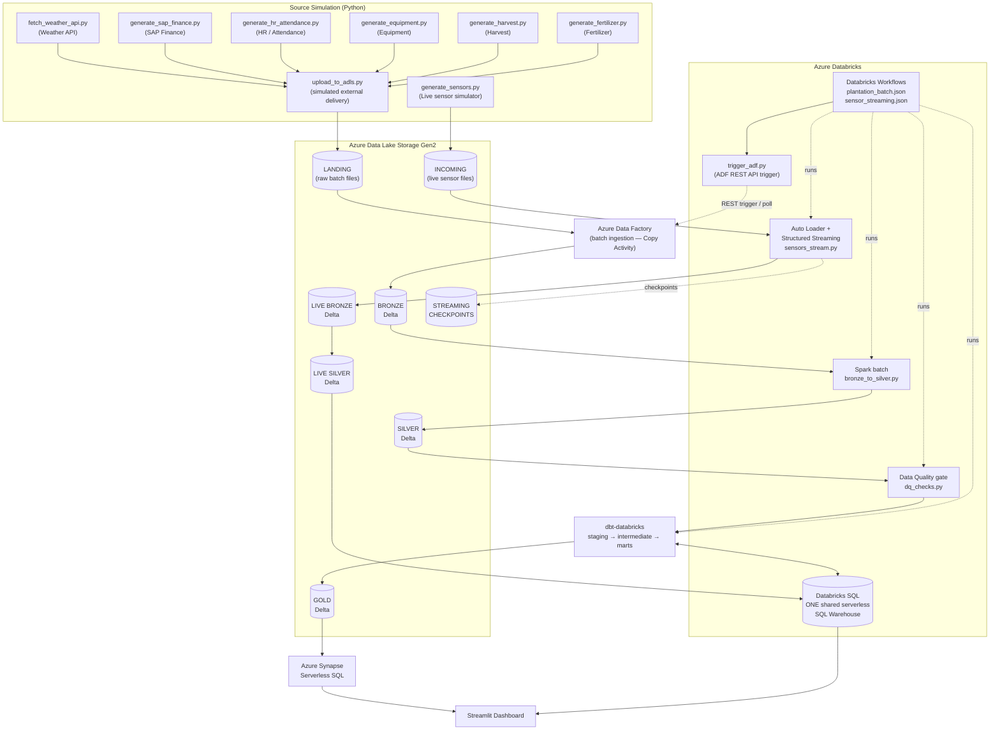

# ARCHITECTURE.md — plantation-simulator-etl-elt

## 1. Project Overview

`plantation-simulator-etl-elt` is an Azure-based plantation analytics platform
built as a Data Engineering portfolio project. It demonstrates an end-to-end
**batch ETL/ELT** pipeline plus a **near-real-time streaming** path over
simulated plantation data sources.

The platform covers:

- Simulated external data sources (Python generators writing files)
- Azure Data Lake Storage Gen2 (ADLS Gen2) as the data lake
- Azure Data Factory (ADF) for batch ingestion (Landing → Bronze)
- Azure Databricks + Apache Spark for Bronze → Silver processing
- Delta Lake as the table/storage format (Bronze, Silver, Gold)
- Data Quality gates before Gold
- dbt-databricks for Silver → Gold business/analytical modeling
- Databricks SQL (one shared serverless SQL Warehouse) for dbt execution and
  live sensor serving
- Azure Synapse Serverless SQL for historical analytical serving
- Auto Loader + Structured Streaming for live sensor data
- Databricks Workflows for batch orchestration
- Streamlit for the dashboard

This document is the **single source of truth** for the architecture.

---

## 2. Architecture Status

> **STATUS: FINAL / FROZEN**
>
> This architecture is decided and frozen. It must not be redesigned without
> explicit human approval. Implementation must follow this document exactly.
> Anything not yet built and verified is **planned**, not implemented; mark
> unverified items as **PENDING** until verified in the real Azure environment.

---

## 3. End-to-End Architecture (Mermaid)



**Planned vs implemented:** everything above is the *target* design. A
component is only "implemented" once it is verified running in the real Azure
environment with recorded evidence.

---

## 4. Batch Architecture

```text
Simulated external sources
        ↓
Python source generators
        ↓
upload_to_adls.py
        ↓
ADLS Gen2 LANDING
        ↓
Azure Data Factory (batch ingestion — Copy Activity)
        ↓
ADLS Gen2 BRONZE — Delta
        ↓
Azure Databricks Spark (clean/validate/dedupe/standardize/transform)
        ↓
ADLS Gen2 SILVER — Delta
        ↓
Data Quality checks (gate)
        ↓
dbt-databricks (staging → intermediate → marts)
        ↓
Databricks SQL Warehouse (dbt execution backend)
        ↓
ADLS Gen2 GOLD — Delta
        ↓
Azure Synapse Serverless SQL (historical serving)
        ↓
Streamlit Dashboard
```

Batch is orchestrated by **Databricks Workflows**, which triggers ADF via the
ADF REST API, waits/polls for completion, then runs Spark → DQ → dbt.

---

## 5. Streaming Architecture

```text
Live sensor simulator
        ↓
ADLS Gen2 INCOMING
        ↓
Azure Databricks Auto Loader (incremental file discovery)
        ↓
Structured Streaming
        ↓
Live Bronze Delta
        ↓
Live Silver Delta
        ↓
Databricks SQL (live serving)
        ↓
Streamlit Dashboard
```

Streaming **does NOT** go through Azure Data Factory, dbt, Gold, or Synapse.
This separation is intentional:

- The streaming path is a lightweight near-real-time path for current sensor
  state, not a full analytical pipeline.
- Keeping it separate avoids coupling the live path to batch orchestration and
  keeps the demo achievable within the project's time and cost constraints.

---

## 6. Source Simulation

All sources are **simulated locally with Python**. The generators simulate
external systems; they never write past the Landing zone.

Batch source generators (**implemented and verified in Phase 1**; output
delivered to ADLS Landing):

| File | Simulated source |
|---|---|
| `data_generators/fetch_weather_api.py` | Weather API (deterministic mock mode; live OpenWeather mode optional) |
| `data_generators/generate_sap_finance.py` | SAP Finance |
| `data_generators/generate_hr_attendance.py` | HR / Attendance |
| `data_generators/generate_equipment.py` | Equipment |
| `data_generators/generate_harvest.py` | Harvest |
| `data_generators/generate_fertilizer.py` | Fertilizer |

Live sensor simulator (**implemented prematurely — Phase 7 scope; NOT executed
and NOT part of the Phase 0/1 batch**; excluded from the Landing uploader):

| File | Purpose |
|---|---|
| `data_generators/generate_sensors.py` | Continuously produces live sensor readings (e.g., temperature, humidity, soil moisture, sensor status) |

Source delivery (**implemented and verified in Phase 1**):

| File | Purpose |
|---|---|
| `data_generators/upload_to_adls.py` | Simulates external systems delivering batch files into **ADLS Landing** |

**Rule:** `upload_to_adls.py` writes to **Landing only**. It must **not**
bypass ADF and write directly to Bronze.

---

## 7. ADLS Landing

- Physical landing zone for raw batch files delivered by the simulated sources.
- Container on ADLS Gen2; files arrive in the source systems' native/raw format.
  Format decided in Phase 1 from the actual generator output: **CSV** (UTF-8,
  header row), one file per source, stored as `landing/<source>/<file>.csv`.
- Landing is the hand-off point between "external world" (simulated) and the
  platform. ADF reads from here.

---

## 8. ADF (Azure Data Factory)

- **Role: batch ingestion / Copy Activity.**
- Scope: **LANDING → BRONZE** only.
- ADF is **not** described as, and must not be used as, a "CSV → Delta
  transformation" engine. Transformation belongs to Databricks/Spark.
- One pipeline per source (or one parameterized pipeline — decided at
  implementation time based on what is simplest and verifiable).
- ADF is triggered by Databricks Workflows through the ADF REST API
  (`trigger_adf.py`), then polled until completion.

---

## 9. Bronze

- Delta tables on ADLS Gen2, written by ADF ingestion.
- Raw-fidelity copy of Landing data: minimal change, append-oriented, source
  of record for reprocessing.
- Bronze is the boundary between ADF (ingestion) and Databricks (processing).

> **Approved deviation — Phase 2 implementation (recorded per §25).**
> The Databricks workspace could not provision the compute capacity required
> by the ADF `AzureDatabricksDeltaLake` connector, so Phase 2 was implemented
> with human approval as **ADF Copy Activity writing Bronze as CSV files**
> (`bronze/<source>/<file>.csv`) — verified live 2026-08-22 (ADF run
> `2df2fdb4-9e78-11f1-a07b-86283166b020`, 48,595 rows, byte-identical to
> Landing). Bronze still becomes **Delta**, written by Databricks/Spark, from
> Phase 3 onward. This note corrects the factual record; it is not a
> redesign, and no service responsibility in §21 changes (ADF remains
> ingestion-only; Spark owns transformation).

---

## 10. Databricks Spark (Batch Processing)

Planned file: `databricks/batch/bronze_to_silver.py` (PENDING)

Responsibilities:

- clean
- validate
- deduplicate
- standardize
- transform
- write Silver Delta

Spark owns all heavy transformation in the batch path. dbt must not
unnecessarily duplicate this logic.

---

## 11. Silver

- Delta tables on ADLS Gen2 written by the Spark batch job.
- Cleaned, validated, deduplicated, standardized, conformed data.
- Silver is the input to the Data Quality gate and to dbt.

---

## 12. Data Quality (DQ)

Planned file: `databricks/batch/dq_checks.py` (PENDING)

DQ is a **validation gate before Gold**. Potential checks (final set defined
during implementation, based on actual data):

- schema checks
- null checks
- duplicate checks
- row count checks
- freshness checks
- valid range checks
- Bronze/Silver reconciliation

**Rule:** Critical DQ failures must **stop downstream processing** (dbt / Gold
must not run on failed data).

---

## 13. dbt

Planned project: `dbt_plantation/` (placeholders exist, implementation PENDING)

```text
dbt_plantation/
models/
├── staging/
├── intermediate/
└── marts/
```

- Adapter: **dbt-databricks**.
- dbt owns: **Silver → Gold** (business transformations and analytical marts).
- dbt provides: business transformations, analytical marts, **tests**, and
  **documentation**.
- dbt executes on the **one shared serverless Databricks SQL Warehouse**.
- Do **not** duplicate Spark transformation logic unnecessarily in dbt — dbt
  starts from clean Silver data.

---

## 14. Gold

- Stored as **Delta on ADLS Gen2**.
- Contains **business-ready analytical marts**.
- Potential example models (indicative only — **do not assume exact schemas**):

  - `dim_plantation`
  - `dim_equipment`
  - `dim_employee`
  - `fact_harvest`
  - `fact_revenue`
  - `fact_fertilizer`
  - `fact_equipment`

> The implementation phase will **inspect the actual generated source data**
> before defining final Gold models and schemas.

---

## 15. Databricks SQL

- **ONE shared serverless SQL Warehouse** is used.
- It serves exactly two purposes:
  1. **dbt execution backend** (Silver → Gold modeling)
  2. **Live sensor serving** (queries over live Silver Delta for Streamlit)
- Do **not** create unnecessary separate warehouses.
- Planned supporting file: `databricks/sql/live_sensor_kpis.sql` (PENDING).

---

## 16. Synapse (Historical Serving)

- **Azure Synapse Serverless SQL** provides historical analytical serving over
  Gold Delta on ADLS Gen2.
- Flow:

  ```text
  Gold Delta → Synapse Serverless → Streamlit
  ```

- **Do NOT use a dedicated Synapse SQL pool.** Serverless only (pay per query).
- Planned supporting files (PENDING):
  - `synapse/sql/external_tables.sql`
  - `synapse/sql/plantation_views.sql`
- Verify in the real subscription that the serverless endpoint can read Delta
  on ADLS before claiming this path works.

---

## 17. Streaming Checkpoints

- Structured Streaming **checkpoints live in ADLS Gen2** (dedicated checkpoint
  location per stream).
- Checkpoints enable exactly-once/incremental recovery semantics for the live
  Bronze → live Silver flow.
- **Never commit checkpoints to Git.** Local data/checkpoint folders are
  excluded from version control.

---

## 18. Databricks Workflows

Two separate workflows:

| Workflow | Planned file | Purpose |
|---|---|---|
| Batch | `databricks/workflows/plantation_batch.json` | Orchestrates the batch pipeline (trigger ADF → poll → Spark → DQ → dbt → Gold) |
| Streaming | `databricks/workflows/sensor_streaming.json` | Runs the continuous streaming job (`sensors_stream.py`) as a separate, long-running job |

The streaming job is **separate from the batch workflow** — they have different
lifecycles (scheduled/triggered batch vs continuous stream).

Conceptual batch orchestration:

```text
Databricks Workflows
        ↓
Trigger ADF
        ↓
Wait / poll ADF
        ↓
Databricks Spark
        ↓
DQ
        ↓
dbt
        ↓
Gold
```

---

## 19. ADF REST API Trigger

Planned file: `databricks/orchestrator/trigger_adf.py` (PENDING)

- A future Python/notebook task inside the batch workflow.
- Uses the **Azure Data Factory REST API** to:
  1. trigger the ADF pipeline run, and
  2. poll/wait until the run reaches a terminal state.
- Credentials must come from secure configuration (service principal /
  environment variables / Key Vault) — never hard-coded, never committed.

---

## 20. Streamlit Dashboard

Planned file: `dashboard/app.py` (PENDING)

- Built with **Streamlit**.
- **Historical data path:** Synapse Serverless SQL → Streamlit.
- **Live data path:** Databricks SQL (over live Silver Delta) → Streamlit.

Potential dashboard sections (indicative, refined during implementation):

- Plantation overview
- Harvest
- Revenue / Costs
- Fertilizer
- Equipment
- Live Sensors
  - Temperature
  - Humidity
  - Soil Moisture
  - Sensor Status

---

## 21. Service Responsibility Table

| Service | Responsibility |
|---|---|
| Azure Data Lake Storage Gen2 | Physical data lake storage (Landing, Incoming, Bronze, Silver, Gold, live Bronze/Silver, checkpoints) |
| Azure Data Factory | Batch ingestion / Copy Activity (Landing → Bronze) |
| Azure Databricks + Spark | Bronze → Silver processing (clean, validate, dedupe, standardize, transform) |
| Delta Lake | Table/storage format for Bronze, Silver, and Gold (and live Bronze/Silver) |
| Data Quality | Validation gate before Gold |
| dbt-databricks | Silver → Gold business/analytical modeling (+ tests, docs) |
| Databricks SQL | dbt execution backend + live sensor serving (ONE shared serverless warehouse) |
| Azure Synapse Serverless SQL | Historical analytical serving over Gold |
| Auto Loader | Incremental file discovery for streaming |
| Structured Streaming | Live sensor processing |
| Databricks Workflows | Batch orchestration (and hosting the continuous streaming job) |
| Streamlit | Dashboard (historical via Synapse, live via Databricks SQL) |

---

## 22. Data Layer Definitions

| Layer | Format | Written by | Contents |
|---|---|---|---|
| Landing | Raw source files (format finalized in Phase 1) | `upload_to_adls.py` | Raw batch payloads as "delivered" by simulated external systems |
| Incoming | Raw sensor files | `generate_sensors.py` | Live sensor readings as arriving files |
| Bronze | Delta on ADLS | ADF Copy Activity | Raw-fidelity copy of Landing |
| Silver | Delta on ADLS | Databricks Spark | Cleaned, validated, deduplicated, standardized, conformed data |
| Gold | Delta on ADLS | dbt-databricks | Business-ready analytical marts (dims + facts) |
| Live Bronze | Delta on ADLS | Auto Loader + Structured Streaming | Raw-fidelity live sensor stream |
| Live Silver | Delta on ADLS | Structured Streaming | Processed live sensor state/history |
| Checkpoints | ADLS files | Structured Streaming | Stream recovery state (never in Git) |

> **Approved deviation — Phase 2 implementation (see §9):** Bronze was
> implemented in Phase 2 as **CSV files written by ADF Copy Activity**
> (not Delta), because the Databricks-based Delta sink could not be
> provisioned. Delta for Bronze is introduced in Phase 3, written by
> Databricks/Spark.

---

## 23. Architectural Principles

1. **Single responsibility per service** — each Azure service does one job (see
   the responsibility table). No overlap, no redundancy.
2. **Ingestion ≠ transformation** — ADF ingests; Spark transforms; dbt models
   business logic. Each layer stays in its lane.
3. **Delta everywhere it matters** — Bronze, Silver, Gold, and live layers are
   Delta on ADLS Gen2.
4. **Quality gate before Gold** — bad data never reaches Gold or the dashboard.
5. **One warehouse, two uses** — a single serverless Databricks SQL Warehouse
   serves dbt execution and live serving.
6. **Serverless where possible** — Synapse Serverless SQL (no dedicated pool),
   serverless SQL Warehouse, minimal always-on infrastructure for cost control.
7. **Batch and streaming are separate paths** — streaming bypasses ADF, dbt,
   Gold, and Synapse by design.
8. **No invented detail** — schemas, configs, and resources are defined from
   inspected reality, not assumptions; unverified items stay PENDING.
9. **Portfolio pragmatism** — the design must be achievable in approximately
   one day; simple and working beats elaborate and theoretical.

---

## 24. Intentionally Excluded Services

The following are **intentionally excluded** and must not be introduced:

- Kafka
- Azure Event Hubs
- Azure IoT Hub
- Airflow
- Kubernetes
- Microsoft Fabric
- Power BI
- Dedicated Synapse SQL pool

Rationale: the project does **not** need every Azure service. The architecture
is deliberately coherent and achievable in approximately one day as a portfolio
project.

---

## 25. Architecture Freeze Statement

> This architecture is **FINAL / FROZEN** as of the planning phase.
>
> - No redesign without explicit human approval.
> - No excluded services may be introduced.
> - Service responsibilities (§21) and flow ownership (§4, §5) are binding.
> - Changes are only permitted to correct factual errors discovered during
>   verified implementation, and any such change must be documented here and
>   reflected consistently in `AGENTS.md` and `IMPLEMENTATION_PLAN.md`.
