# Plantation Simulator — Azure Data Engineering Platform

An end-to-end **Azure Data Engineering portfolio project** that simulates the
operations-analytics platform of a plantation business. It demonstrates two
complete, independently-runnable data paths over fully simulated data:

- a **batch ETL/ELT pipeline** (six operational sources → Azure Data Lake →
  Azure Data Factory → Databricks Spark → Delta Silver → Data Quality gate →
  Delta Gold → Synapse Serverless SQL → Streamlit), and
- a **live sensor streaming path** (IoT sensors → ADLS Incoming → Databricks
  Auto Loader → Delta Live Bronze → Delta Live Silver → Databricks SQL →
  Streamlit).

Everything runs on **Azure Data Lake Storage Gen2, Azure Data Factory, Azure
Databricks (Serverless + Unity Catalog), Delta Lake, Azure Synapse Serverless
SQL, Databricks SQL, and Streamlit**. All data is **simulated locally** — no real
plantation data is used.

> **Verified end-to-end on 2026-08-24.** Every row count, run ID, and result in
> this document was observed in the real Azure/Databricks environment and is
> indexed in [`docs/evidence/phase-10/EVIDENCE_INDEX.md`](docs/evidence/phase-10/EVIDENCE_INDEX.md).
> Nothing here is aspirational.

---

## Architecture (End-to-End)

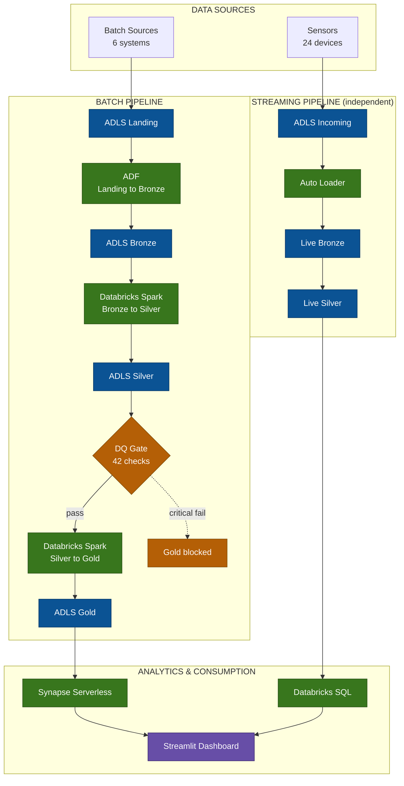
```mermaid
flowchart TB
    subgraph SOURCES["DATA SOURCES"]
        GEN["Batch Sources<br/>6 systems"]
        SEN["Sensors<br/>24 devices"]
    end

    subgraph BATCH["BATCH PIPELINE"]
        LND["ADLS Landing"]
        ADF["ADF<br/>Landing to Bronze"]
        BRZ["ADLS Bronze"]
        B2S["Databricks Spark<br/>Bronze to Silver"]
        SLV["ADLS Silver"]
        DQ{"DQ Gate<br/>42 checks"}
        S2G["Databricks Spark<br/>Silver to Gold"]
        GLD["ADLS Gold"]
        LND --> ADF --> BRZ --> B2S --> SLV --> DQ
        DQ -->|"pass"| S2G --> GLD
        DQ -.->|"critical fail"| BLK["Gold blocked"]
    end

    subgraph STREAM["STREAMING PIPELINE (independent)"]
        INC["ADLS Incoming"]
        AL["Auto Loader"]
        LBRZ["Live Bronze"]
        LSLV["Live Silver"]
        INC --> AL --> LBRZ --> LSLV
    end

    subgraph AN["ANALYTICS & CONSUMPTION"]
        SYN["Synapse Serverless"]
        DBSQL["Databricks SQL"]
        DASH["Streamlit Dashboard"]
        SYN --> DASH
        DBSQL --> DASH
    end

    GEN --> LND
    SEN --> INC
    GLD --> SYN
    LSLV --> DBSQL

    classDef store fill:#0b5394,color:#fff,stroke:#073763;
    classDef svc fill:#38761d,color:#fff,stroke:#274e13;
    classDef gate fill:#b45f06,color:#fff,stroke:#7f4e03;
    classDef dash fill:#674ea7,color:#fff,stroke:#3d2c6e;
    class LND,BRZ,SLV,GLD,INC,LBRZ,LSLV store;
    class ADF,B2S,S2G,AL,SYN,DBSQL svc;
    class DQ,BLK gate;
    class DASH dash;
```

**Reading the diagram.** The **batch** path is a scheduled/triggered ETL/ELT
pipeline orchestrated by **Databricks Workflows** (`plantation_batch`), which
triggers **ADF** via REST and hard-gates Gold behind a **Data Quality gate**: if
any CRITICAL check fails, `silver_to_gold` is skipped ("Gold blocked"). The
**streaming** path is a self-contained, near-real-time lane that is **fully
independent** of batch — it does not touch ADF, the DQ gate, Gold, or Synapse.
The two paths converge only at the **Streamlit dashboard**, which reads
historical analytics from **Synapse Serverless SQL** (over Gold) and live sensor
telemetry from **Databricks SQL** (over live Silver).

Pipeline/activity names, formats, row counts, checkpoint paths, credentials, and
orchestration detail are documented in the sections below (§7–§17) rather than
inside the diagram.

---

## 1. Project Overview

This project answers a realistic data-engineering question: *how would you
build a plantation's operational analytics platform on Azure, from raw source
systems all the way to a decision-facing dashboard?*

A plantation generates many kinds of operational data — weather observations,
harvest records, fertilizer applications, equipment telemetry, HR attendance,
and SAP financial postings — plus a continuous stream of field-sensor readings.
This project builds the full platform that ingests, stores, transforms,
quality-gates, models, and serves all of it:

1. **Six batch source systems** are simulated by Python generators that write
   CSV files (48,595 rows total) and deliver them to an ADLS Gen2 **Landing**
   zone, mimicking external systems dropping files.
2. **Azure Data Factory** ingests Landing → **Bronze** (raw-fidelity copy).
3. **Databricks Spark** cleans, validates, deduplicates, and standardizes Bronze
   → **Silver** (Delta).
4. A **Data Quality gate** runs 42 checks; Gold only proceeds if every
   CRITICAL check passes.
5. **Databricks Spark** models Silver → **Gold** (Delta dimensions + facts,
   40,166 rows).
6. **Azure Synapse Serverless SQL** exposes Gold to analytics with no
   provisioned warehouse.
7. Independently, a **streaming path** ingests live sensor files with **Auto
   Loader** into Live Bronze/Live Silver Delta and serves them through
   **Databricks SQL**.
8. A **Streamlit dashboard** consumes both the historical (Synapse) and live
   (Databricks SQL) paths.

The whole batch flow is orchestrated by a **Databricks serverless Git-source
workflow** that triggers ADF through the ADF REST API and polls it to a
terminal state before running Spark → DQ → Spark → Gold in sequence.

---

## 2. Business / Engineering Problem

A plantation operator needs a single place to answer questions like:

- How much have we harvested, by crop, block, and over time?
- What are our operating costs by category, cost center, and fiscal period?
- How is our equipment fleet utilized, and how much fuel is it burning?
- What does our workforce look like by role and department?
- *Right now:* are our field sensors healthy, and what are current soil / air
  conditions?

The engineering challenge is that these live in **separate systems** with
different cadences (daily batch operational data vs. 15-minute sensor
telemetry), different quality characteristics, and different consumers. The
platform must:

- **ingest** heterogeneous batch files reliably,
- **transform** them into clean, conformed, deduplicated data,
- **guarantee quality** before anything reaches analytics,
- **model** the data into business-ready dimensions and facts,
- **serve** it cheaply (serverless) for historical analysis,
- and handle **live telemetry** on a separate, lightweight path.

This repository is a complete, verified reference implementation of exactly
that platform.

---

## 3. Project Objectives

- Build a **real, working** end-to-end Azure data platform (not a toy).
- Demonstrate a **medallion architecture** (Landing → Bronze → Silver → Gold)
  on ADLS Gen2 with Delta Lake.
- Show a clear **separation of responsibilities**: ADF ingests, Spark
  transforms, Synapse/Databricks SQL serve, Streamlit presents.
- Implement a **hard Data Quality gate** that blocks Gold on critical failure.
- Demonstrate **Structured Streaming + Auto Loader** with checkpointing on an
  independent live path, honestly scoped (drain-and-stop, not 24/7).
- Use **serverless / pay-per-use** services throughout for cost control.
- Enforce **no secrets in code** — Unity Catalog, managed identities, and
  environment variables only.
- Verify everything **end-to-end in the real environment** and record evidence.

---

## 4. Technology Stack

| Layer / Concern | Technology |
|---|---|
| Cloud / storage | Azure Data Lake Storage Gen2 (`plantationsimulatorrg`, HNS enabled) |
| Batch ingestion | Azure Data Factory (Copy Activity) |
| Batch + stream compute | Azure Databricks (Serverless) + Apache Spark |
| Table format | Delta Lake (Silver, Gold, Live Bronze/Silver) |
| Data Quality | Custom PySpark checks (`dq_checks.py`) |
| Orchestration | Databricks Workflows (serverless, Git-source) + ADF REST API |
| Historical serving | Azure Synapse Serverless SQL |
| Live serving | Databricks SQL (one shared serverless SQL Warehouse) |
| Streaming ingestion | Auto Loader (`cloudFiles`) + Structured Streaming |
| Dashboard | Streamlit (+ Plotly) |
| Source simulation | Python (pandas/numpy), deterministic (seed 42) |
| Language / tooling | Python 3.10, pytest, Ruff |

---

## 5. Architecture Overview

The platform follows a **medallion (multi-hop) architecture** with two
independent ingestion lanes converging at the consumption layer.

**Batch lane (orchestrated, quality-gated):**

```
Generators → upload_to_adls.py → LANDING (CSV)
  → ADF (Copy) → BRONZE (CSV, raw fidelity)
  → Spark bronze_to_silver.py → SILVER (Delta, cleaned/deduped)
  → DQ gate dq_checks.py (42 checks)
  → Spark silver_to_gold.py → GOLD (Delta, dims + facts)
  → Synapse Serverless SQL → Streamlit
```

**Streaming lane (independent, lightweight):**

```
sensor_stream_to_adls.py → INCOMING (CSV micro-batches)
  → Auto Loader + Structured Streaming → LIVE BRONZE (Delta)
  → Structured Streaming → LIVE SILVER (Delta)
  → Databricks SQL → Streamlit
```

**Why two lanes?** Batch operational data and live sensor telemetry have
different lifecycles, cadences, and consumers. Coupling the live path to batch
orchestration (ADF, DQ gate, Gold, Synapse) would add latency, cost, and
fragility for no analytical benefit. The streaming path is deliberately
self-contained — it does **not** go through ADF, the DQ gate, Gold, or Synapse.

**Responsibilities are strictly separated** (see §13):

- **ADF** = ingestion only (Landing → Bronze). It performs no transformation.
- **Spark** = all transformation and business modelling (Bronze→Silver→Gold,
  and Live Bronze→Live Silver).
- **Synapse / Databricks SQL** = serving only (no transformation).
- **Streamlit** = presentation only.

---

## 6. End-to-End Data Flow

### 6.1 Batch Pipeline

| # | Stage | Service / Script | Input → Output | Format |
|---|---|---|---|---|
| 1 | Generate | `data_generators/*` | — → 6 local CSVs | CSV |
| 2 | Deliver | `upload_to_adls.py` | local → ADLS **Landing** | CSV |
| 3 | Ingest | ADF `PL_Ingest_Landing_To_Bronze` | Landing → **Bronze** | CSV |
| 4 | Transform | `bronze_to_silver.py` | Bronze → **Silver** | CSV → Delta |
| 5 | Quality gate | `dq_checks.py` | Silver (vs Bronze) | — |
| 6 | Model | `silver_to_gold.py` | Silver → **Gold** | Delta → Delta |
| 7 | Serve | Synapse Serverless SQL | Gold → `gold.vw_*` | Delta → SQL |
| 8 | Consume | Streamlit | Synapse views → dashboard | — |

### 6.2 Streaming Pipeline

| # | Stage | Service / Script | Input → Output | Format |
|---|---|---|---|---|
| 1 | Generate | `sensor_stream_to_adls.py` | — → ADLS **Incoming** | CSV micro-batch |
| 2 | Ingest | Auto Loader (`sensors_stream.py`) | Incoming → **Live Bronze** | CSV → Delta |
| 3 | Transform | Structured Streaming (`sensors_stream.py`) | Live Bronze → **Live Silver** | Delta → Delta |
| 4 | Serve | Databricks SQL | Live Silver → `live_serving.vw_kpi_*` | Delta → SQL |
| 5 | Consume | Streamlit | Databricks SQL views → dashboard | — |

---

## 7. Batch Data Sources

All six batch sources are **simulated locally** by deterministic Python
generators (global `random_seed = 42`, generation window **2024-01-01 →
2024-03-31**), then delivered to ADLS Landing. Counts below are the **actual
generated and verified** data-row counts (excluding header).

| Source | Generator | Output file (Landing path `landing/<source>/`) | Data rows | Business key |
|---|---|---|---|---|
| Weather | `fetch_weather_api.py` | `weather/weather_observations.csv` | 6,483 | `(station_id, timestamp)` |
| Harvest | `generate_harvest.py` | `harvest/harvest_transactions.csv` | 9,112 | `harvest_id` |
| Fertilizer | `generate_fertilizer.py` | `fertilizer/fertilizer_applications.csv` | 9,000 | `application_id` |
| Equipment | `generate_equipment.py` | `equipment/equipment_logs.csv` | 10,000 | `operation_id` |
| HR / Attendance | `generate_hr_attendance.py` | `hr/hr_attendance.csv` | 2,000 | `attendance_id` |
| SAP Finance | `generate_sap_finance.py` | `finance/sap_finance_transactions.csv` | 12,000 | `(document_id, debit_credit_indicator, gl_account)` |
| **Total** | | | **48,595** | |

### 7.1 Weather — `weather_observations.csv` (6,483 rows)

Simulates an OpenWeatherMap-style weather API for the plantation's regions.
Generated **hourly for 3 stations** over the 91-day window. Runs in
deterministic **mock mode** (`fallback_to_mock: true`; live mode is optional and
disabled for the batch). This is the reference dataset the other generators key
against on `(timestamp, region_id)`.

Columns: `timestamp, station_id, region_id, temperature_c, humidity_pct,
rainfall_mm, wind_speed_kmh, weather_condition, pressure_hpa`.

### 7.2 Harvest — `harvest_transactions.csv` (9,112 rows)

Simulates crop-harvest operations across plantation blocks. Config target was
12,000, but realistic suppression (Sunday skips, heavy-rain days) yields 9,112
actual records. Links to blocks, employees, and equipment.

Columns: `harvest_id, timestamp, block_id, crop_type, employee_id,
equipment_id, harvested_weight_kg, quality_grade, moisture_pct,
collection_duration_minutes, destination, status`.

### 7.3 Fertilizer — `fertilizer_applications.csv` (9,000 rows)

Simulates fertilizer applications per block, with method, material, equipment,
and a weather snapshot at application time.

Columns: `application_id, timestamp, block_id, crop_type, employee_id,
material_id, quantity_kg, application_method, equipment_id, weather_station_id,
weather_condition, rainfall_mm, application_status, notes`.

### 7.4 Equipment — `equipment_logs.csv` (10,000 rows)

Simulates utilization and maintenance logs for a 30-asset fleet (tractors,
harvesters, sprayers, trucks, excavators, drones, pickups).

Columns: `operation_id, timestamp, equipment_id, equipment_type, block_id,
operator_id, operation_type, start_time, end_time, duration_minutes,
engine_hours, fuel_consumption_liters, distance_km, maintenance_flag,
maintenance_type, status`.

### 7.5 HR / Attendance — `hr_attendance.csv` (2,000 rows)

Simulates daily attendance for 24 employees (structurally capped at 24 × 91
days = 2,184). Includes shifts, working/overtime hours, leave, and Malaysian
public-holiday handling, with cross-dataset consistency (employees active in
operations are never marked absent).

Columns: `attendance_id, employee_id, employee_name, role, department,
cost_center_id, attendance_date, shift, check_in_time, check_out_time,
working_hours, overtime_hours, attendance_status, leave_type, work_location,
remarks`.

### 7.6 SAP Finance — `sap_finance_transactions.csv` (12,000 rows)

Simulates **double-entry** SAP financial postings derived from the upstream
operational datasets — 6,000 documents × 2 lines (one Debit `S`, one Credit
`H`). GL accounts and cost centers vary by transaction type; amounts are
computed from the operational records (e.g., harvest labour from weight, fuel
from litres). This generator **requires** the upstream CSVs to exist.

Columns: `document_id, posting_date, posting_timestamp, fiscal_year,
fiscal_period, company_code, cost_center_id, gl_account, transaction_type,
reference_document, employee_id, equipment_id, material_id, amount, currency,
debit_credit_indicator, description`.

---

## 8. Source Generation

**How it works.** Each generator is a standalone, deterministic Python module
driven by `data_generators/config.yaml`. The shared config defines the global
`random_seed: 42`, the generation window (`2024-01-01` → `2024-03-31`), target
dataset sizes, and master/reference data (3 weather stations, 4 crop types, 10
blocks `BLK01–BLK10`, 30 equipment `EQP001–EQP030`, 5 materials, 4 cost centers,
24 employees `EMP001–EMP024`).

`run_batch_generators.py` orchestrates the six batch generators **in dependency
order** — weather first (it is the temporal/regional reference), finance last
(it consumes the operational outputs). Each generator writes one CSV to
`data/raw/<source>/<file>.csv`.

**Determinism.** Every generator calls `random.seed(42)`, so output is
reproducible. Note that *target* sizes are not always the *actual* row counts:
realistic suppression logic (Sunday/holiday skips, weather-driven
cancellations, the 24-employee × 91-day HR cap, and double-entry finance
expansion) produces the final verified counts in §7.

**Why simulate?** Simulation gives a realistic, self-contained, reproducible,
and cost-free dataset with known ground truth — ideal for a portfolio project
where real plantation operational data is unavailable and where determinism
makes verification exact.

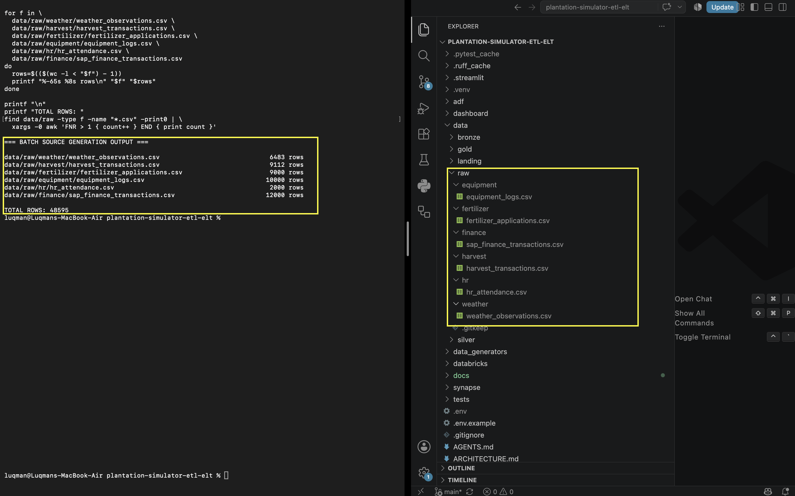/"
  width="900"
/>

**Figure 01 — Source generation.** `run_batch_generators.py` completes and the six generated CSVs appear under `data/raw/<source>/` with file sizes — the six sources are generated locally at the documented sizes.

---

## 9. ADLS Gen2 — Landing Layer

**Purpose.** Landing is the **ingestion boundary** between the (simulated)
external world and the platform. Source systems "drop" their raw files here;
nothing downstream writes to Landing. It exists separately from Bronze so that
the raw delivery (owned by the external/uploader side) is decoupled from the
curated raw copy (owned by ADF ingestion), and so Landing is never mutated by
the pipeline.

**Writer.** `upload_to_adls.py` — and it writes to **Landing only**
(`ALLOWED_LAYER = "landing"`; it explicitly rejects `bronze`, `silver`, `gold`,
`incoming`, `live-bronze`, `live-silver`, `checkpoints`). The six batch sources
are uploaded; **sensors are deliberately excluded** (they belong to the
streaming path → Incoming).

**Path structure.** `landing/<source>/<filename>.csv`, preserving the per-source
folder layout (e.g., `landing/harvest/harvest_transactions.csv`). Uploads
overwrite (idempotent re-delivery). Authentication is via env-var account name +
account key using ADLS Gen2 Shared Key REST signing; with no key set, the
uploader runs in **DRY-RUN** mode (no network calls).

**Verified state.** 6 blobs, 48,595 rows, **byte-identical** to the local CSVs.

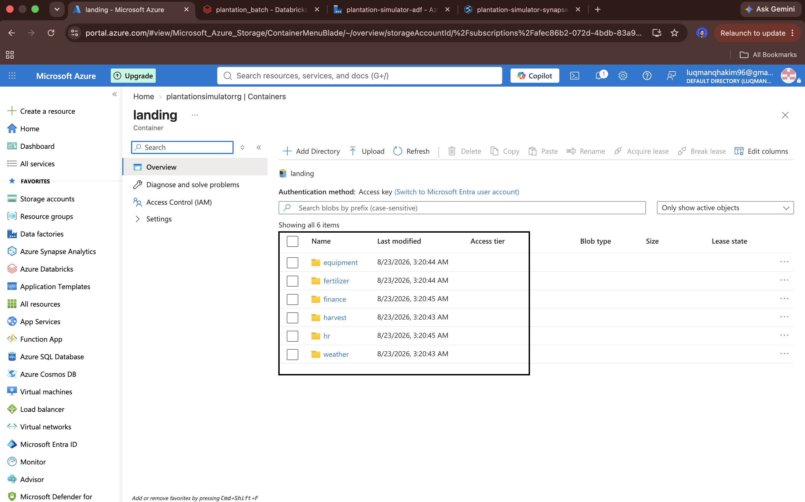

**Figure 02 — ADLS Landing.** The `landing` container holds the six source folders/files and sizes — the source files reached Landing before ADF ingestion.

---

## 10. Azure Data Factory (Batch Ingestion)

**Role in this project: ingestion only.** ADF copies Landing → Bronze. It
performs **no transformation** — that is deliberately reserved for Spark. This
keeps a clean single-responsibility boundary: ADF moves bytes; Spark shapes
data.

**Pipeline:** `PL_Ingest_Landing_To_Bronze`

- **Structure:** a single top-level **ForEach** (`ForEach_Landing_Source`,
  `isSequential: true`) that iterates the six `{sourceFolder, sourceFile}`
  items, running one **Copy** activity (`Copy_Landing_To_Bronze`) per source.
- **Parameters:** `SourceContainer` (default `landing`), `SinkContainer`
  (default `bronze`), and `SourceItems` (the six-source array). The workflow
  triggers it with an empty body, so all defaults apply.
- **Copy behaviour:**
  - Source = `DelimitedTextSource` reading the Landing file by wildcard
    (`deleteFilesAfterCompletion: false` — Landing is never modified).
  - Sink = `DelimitedTextSink` writing `bronze/<source>/<file>.csv` with
    **`copyBehavior: "Overwrite"`** → idempotent reruns, no duplicates.
  - `enableStaging: false`; policy `timeout 12h`, `retry 2`, `retryInterval 30s`.
- **Datasets:** `DS_Landing_Source` and `DS_Bronze_Sink` — both `DelimitedText`
  (CSV, UTF-8, comma, header row), parameterized by container/folder/file.
- **Linked service:** `LS_Adls_PlantationSimulator` (`AzureBlobFS`) pointing at
  `https://plantationsimulatorrg.dfs.core.windows.net`. It carries **no key,
  SAS, or secret** — authentication is the **ADF system-assigned managed
  identity**, granted *Storage Blob Data Contributor* on the storage account.

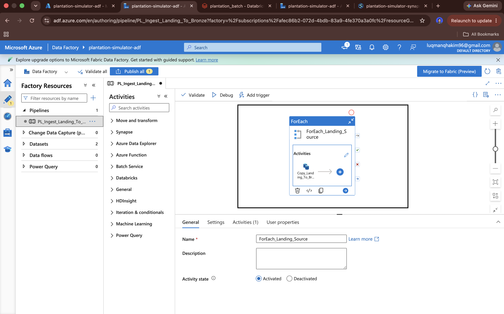

**Figure 03a — ADF pipeline overview.**

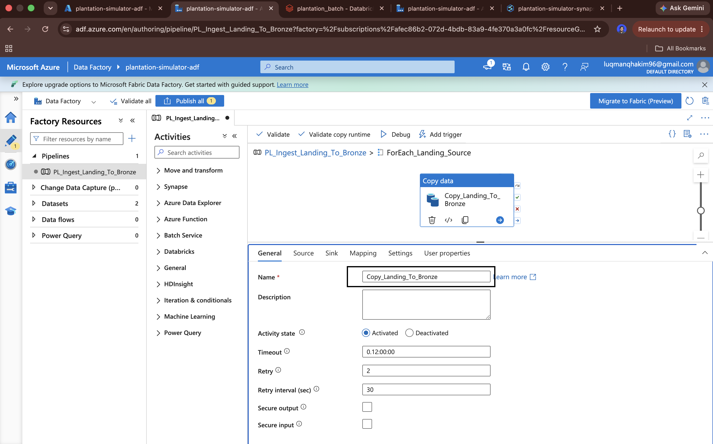

**Figure 03b — ADF ForEach and Copy activity.**

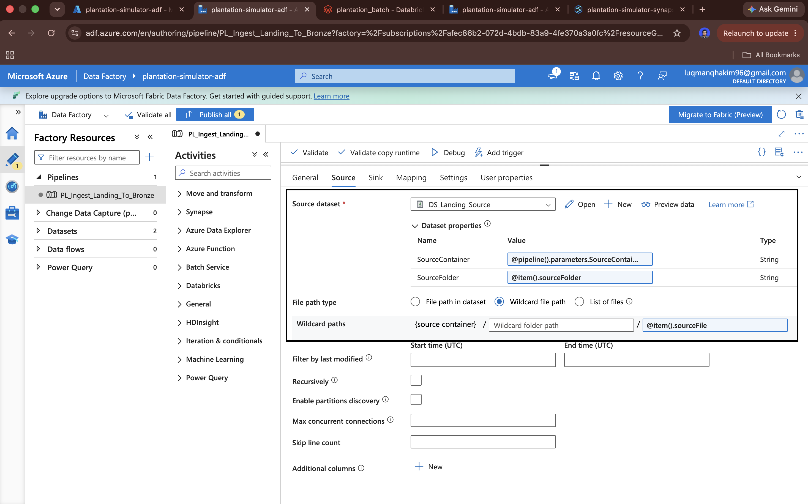

**Figure 03c — ADF Landing source configuration.**

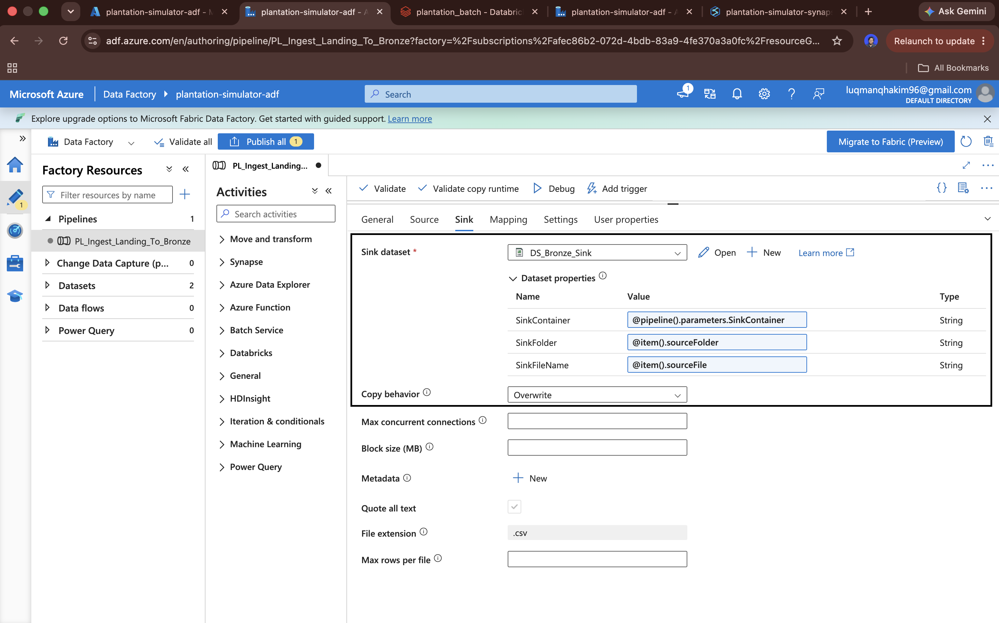/<file>.csv with Overwrite"
  width="900"
/>

**Figure 03d — ADF Bronze sink configuration.**

### 10.1 How Databricks orchestrates ADF (REST)

The batch workflow does not run ADF on a schedule; it **triggers and supervises**
ADF via the ADF REST API, using `databricks/orchestrator/trigger_adf.py` as the
first task:

```
Databricks Workflow (plantation_batch)
  → task trigger_adf  (trigger_adf.py)
      → POST .../pipelines/PL_Ingest_Landing_To_Bronze/createRun   (runId)
      → GET  .../pipelineruns/{runId}  every 30s until terminal
      → Succeeded? return normally : raise
  → task bronze_to_silver   (only after ADF Succeeded)
```

- **Trigger:** `POST` to the ADF `createRun` endpoint (`api-version=2018-06-01`)
  with an empty JSON body; extracts `runId`.
- **Poll:** `GET` the `pipelineruns/{runId}` endpoint every **30s** (default),
  up to a **30-minute** timeout, until a terminal status
  (`Succeeded` / `Failed` / `Cancelled`).
- **Authentication:** a **Service Principal**. On Databricks the client
  id/secret/tenant are read at runtime from the Databricks **secret scope
  `adf-sp`** (`client-id` / `client-secret` / `tenant-id`) via
  `dbutils.secrets.get`, then a `ClientSecretCredential` acquires an ARM token
  (`https://management.azure.com/.default`). Locally it falls back to
  `DefaultAzureCredential`. No secret is ever logged or committed.
- **Success/failure contract (important):** on Databricks Serverless, **any**
  `SystemExit` — even `SystemExit(0)` — is surfaced as a task failure. So
  `trigger_adf.py` signals by **exception, not exit code**: success = `main()`
  returns normally; failure = it raises (`AdfRunError` on Failed/Cancelled,
  `AdfConfigError` on timeout/HTTP/auth). The workflow proceeds to
  `bronze_to_silver` **only** when ADF reports `Succeeded`.

**Why ADF here?** A dedicated, managed ingestion service cleanly separates
"getting bytes into the lake" from "processing them", gives managed-identity
authentication and reliable retry/overwrite semantics, and demonstrates the
common enterprise pattern of ADF-for-ingest + Databricks-for-transform.

**Verified run:** `21ae0695-8c8e-455e-9029-996aec96c3ea` — Succeeded
(2026-08-24T16:13:19Z → 16:15:47Z, ~148s), 6 Copy activities, triggered by the
workflow.

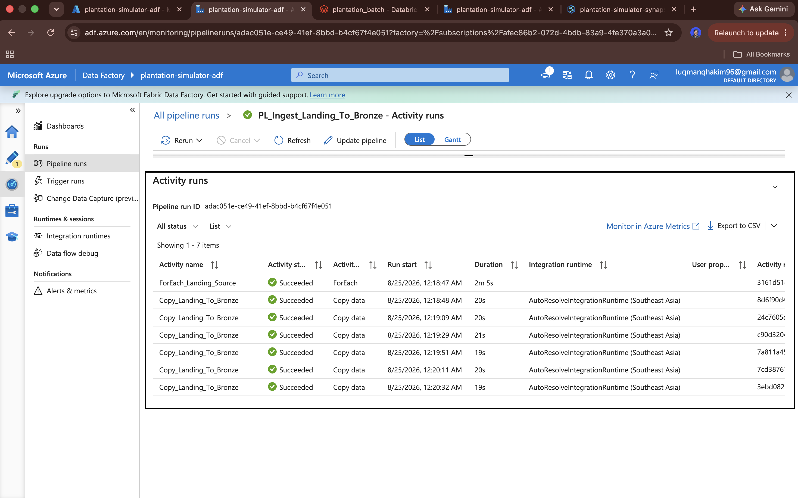

**Figure 04 — Successful ADF pipeline execution.**

---

## 11. ADLS Bronze

**What it is.** Bronze is the **raw-fidelity copy** of Landing — the durable
source of record for reprocessing. It is written by the ADF Copy Activity.

**Format (approved deviation): CSV.** The original design wrote Bronze as Delta
via a Databricks-linked ADF connector, but the Databricks workspace **could not
provision the compute** that connector required. With human approval, Phase 2
was implemented as **ADF writing Bronze as CSV files**
(`bronze/<source>/<file>.csv`). Bronze still becomes **Delta from the next stage
onward**, written by Spark (§12). This is a documented, intentional deviation —
not an accident.

**Contents.** 6 CSVs, **48,595 rows**, **byte-identical to Landing** (row counts
and byte sizes verified per source; total 48,595). Bronze contains **no**
`_delta_log` — it is plain CSV by design.

**Relationship to Landing.** Landing = the raw drop (external boundary);
Bronze = the curated raw copy (ingestion boundary). They are byte-identical;
the difference is ownership and role, not content. Bronze is the hand-off point
from ADF (ingestion) to Databricks (processing).

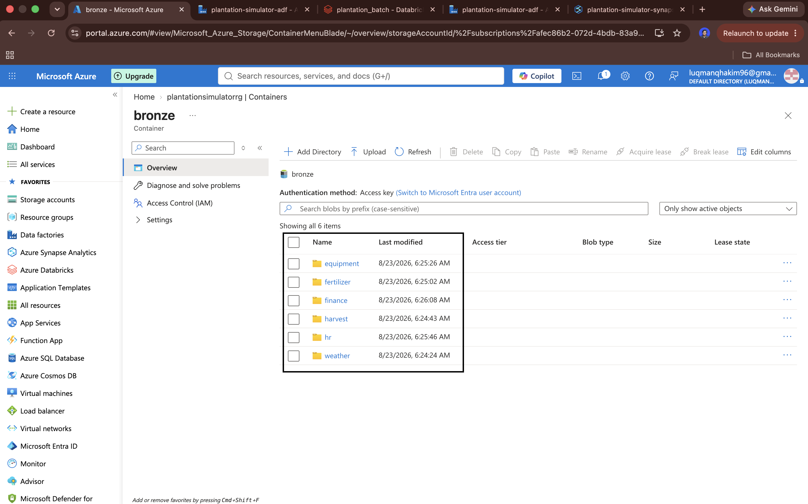

**Figure 05 — ADLS Bronze.** The `bronze` container holds the six CSVs with sizes matching Landing — ADF produced a complete raw-fidelity copy.

---

## 12. Databricks — Bronze → Silver

`databricks/batch/bronze_to_silver.py` is the Spark job that turns raw Bronze
CSV into clean, conformed **Silver Delta**. It runs on **Databricks Serverless**
and accesses ADLS through **Unity Catalog external locations** (storage
credential `plantation_external_adls`) — **no** storage account key, SAS token,
PAT, or secret is ever set (`fs.azure.account.key.*` is never configured).

**Input:** `abfss://bronze@plantationsimulatorrg.dfs.core.windows.net/<source>/<file>.csv`
**Output:** `abfss://silver@plantationsimulatorrg.dfs.core.windows.net/<source>`
— **Delta**, `mode=overwrite`, `overwriteSchema=true`, **no partitioning**.

**Common processing for every source:** read CSV with an **explicit schema**
(no inference); standardize text keys with `UPPER(TRIM(...))`; parse
timestamps/dates; nullify blank optional fields; drop rows missing the primary
key; **deduplicate on the business key**; add an `_ingested_at` audit timestamp;
write Delta.

**Per-source specifics:**

| Source | Dedup key | Notable transformations |
|---|---|---|
| weather | `(station_id, timestamp)` | `timestamp`→timestamp; upper/trim station/region/condition |
| harvest | `harvest_id` | nullify blank `equipment_id`,`destination`; upper/trim keys/grade/status |
| fertilizer | `application_id` | nullify blank `equipment_id`,`notes`,`weather_station_id` |
| equipment | `operation_id` | nullify blank `block_id`,`operator_id`,`maintenance_type`; parse start/end |
| hr | `attendance_id` | `attendance_date`→date; nullify blank check-in/out, leave, remarks |
| finance | `(document_id, debit_credit_indicator, gl_account)` | `amount`→`Decimal(18,2)`; nullify blank refs; parse posting date/timestamp |

**Why Spark?** Bronze→Silver is real transformation (schema enforcement,
cleaning, validation, dedup, standardization) — exactly what a distributed
DataFrame engine is for, and it keeps transformation out of ADF. Like all task
scripts, it signals success by returning normally and failure by raising (no
`SystemExit`).

**Verified:** 6 Silver Delta tables, **48,595 rows** (matches Bronze exactly).

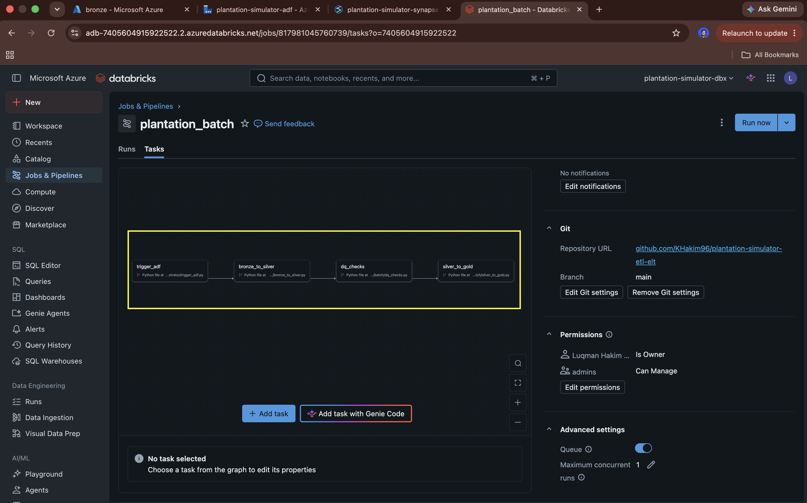

**Figure 06a — Databricks batch workflow.** The `plantation_batch` DAG: `trigger_adf → bronze_to_silver → dq_checks → silver_to_gold`.

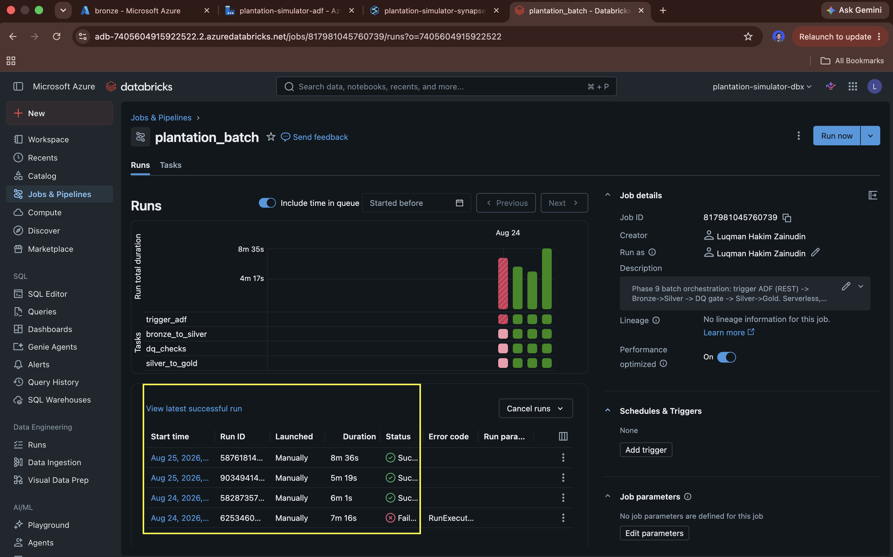

**Figure 06b — Databricks batch run.**

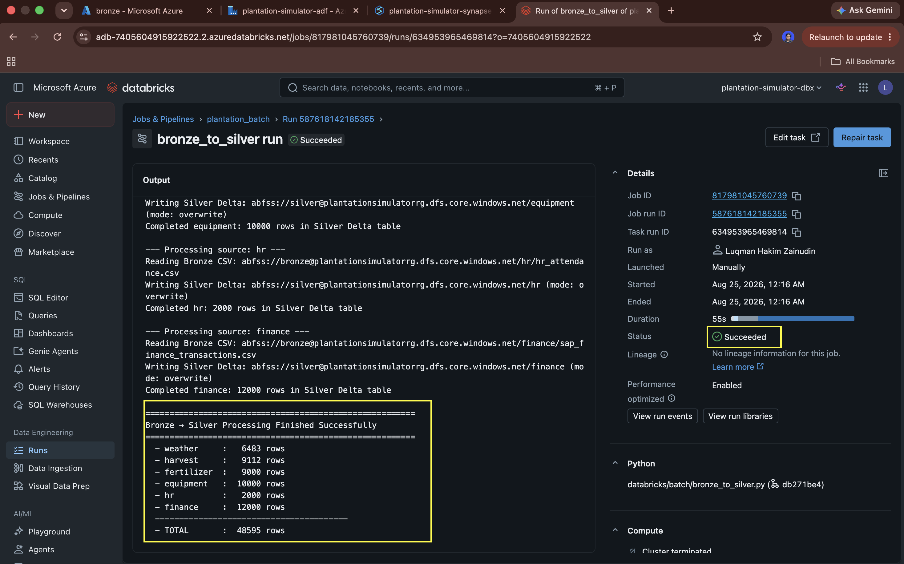

**Figure 07 — Bronze → Silver task.**

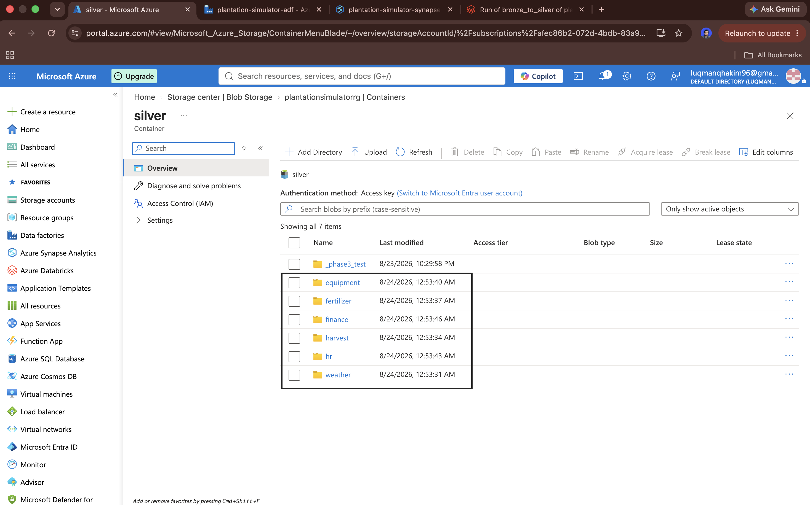

**Figure 08 — ADLS Silver.** The `silver` container holds the six Delta folders (`_delta_log` present).

---

## 13. Data Quality Gate

`databricks/batch/dq_checks.py` is the **hard gate** between Silver and Gold.
It runs **7 checks per source × 6 sources = 42 checks**, and Gold proceeds
**only if every CRITICAL check passes**.

| Check | Type | What it validates |
|---|---|---|
| `schema` | CRITICAL | Required columns (incl. `_ingested_at`) are present |
| `nulls` | CRITICAL | Business-key columns contain no NULLs |
| `duplicates` | CRITICAL | Business-key uniqueness (0 duplicate groups) |
| `row_count` | CRITICAL | Silver count == expected count |
| `reconciliation` | CRITICAL | Silver count == Bronze distinct-business-key count |
| `valid_ranges` | NON-CRITICAL | Numeric measures within plausible bounds |
| `freshness` | NON-CRITICAL | Newest `_ingested_at` within 30 days |

- **Reconciliation** recomputes the Bronze **distinct business-key** count
  (normalizing string keys with `UPPER(TRIM())` to mirror dedup semantics) and
  requires Silver to match it — proving no rows were silently lost or
  duplicated between Bronze and Silver.
- **CRITICAL vs NON-CRITICAL:** the overall gate **passes only if no CRITICAL
  check fails**. NON-CRITICAL failures (`valid_ranges`, `freshness`) are
  reported but do **not** block Gold.
- **Signal:** success = `main()` returns; **any CRITICAL failure raises** a
  `RuntimeError` ("DQ gate FAILED … downstream Gold processing blocked"),
  failing the task.
- **Expected counts (hard-coded ground truth):** weather 6,483 · harvest 9,112
  · fertilizer 9,000 · equipment 10,000 · hr 2,000 · finance 12,000 → **48,595**.

### 13.1 How the gate controls Gold (workflow dependency)

```
trigger_adf → bronze_to_silver → dq_checks → silver_to_gold
```

The workflow wires `silver_to_gold` with `depends_on: dq_checks`. Therefore:

- **DQ succeeds** → `silver_to_gold` runs → Gold is rebuilt.
- **Any CRITICAL DQ check fails** → `dq_checks` raises → task fails →
  `silver_to_gold` is **skipped**. Bad data never reaches Gold.

**Verified:** **42/42 PASS** (run `721436103247199`).

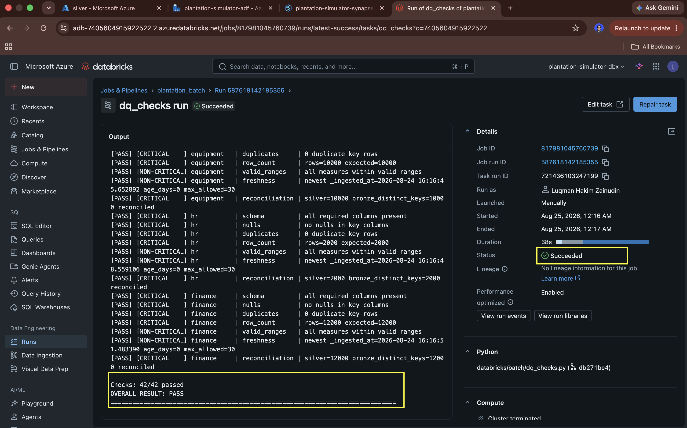

**Figure 09 — DQ task.**

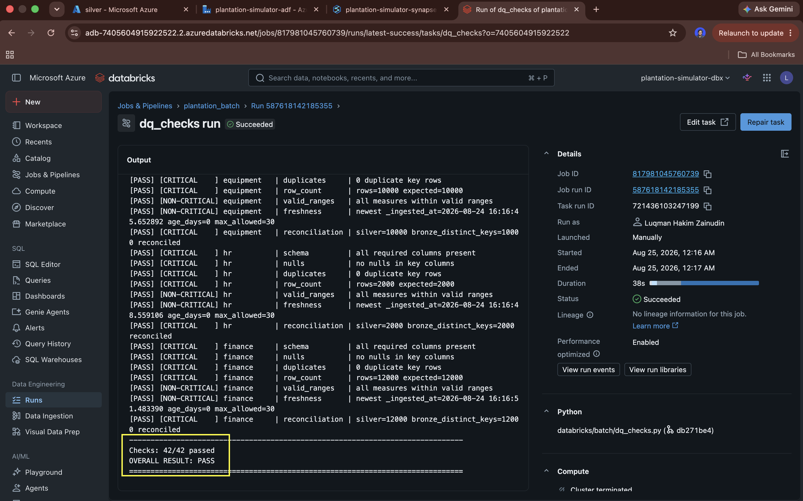

**Figure 10 — DQ 42/42 PASS.**

---

## 14. Silver → Gold

`databricks/batch/silver_to_gold.py` models the clean Silver data into
**business-ready Gold** Delta — two dimensions and four facts. It reads Silver
(starting from DQ-verified data, with no duplication of Bronze→Silver logic)
and writes Gold **idempotently** (`mode=overwrite`, `overwriteSchema=true` — a
deterministic full refresh, so reruns never append duplicates).

**Output:** `abfss://gold@plantationsimulatorrg.dfs.core.windows.net/<model>`

| Gold model | Type | Source (Silver) | Grain | Verified rows |
|---|---|---|---|---|
| `dim_equipment` | Dimension | `equipment` | one row per `equipment_id` | 30 |
| `dim_employee` | Dimension | `hr` | one row per `employee_id` | 24 |
| `fact_harvest` | Fact | `harvest` | one row per `harvest_id` | 9,112 |
| `fact_revenue` | Fact | `finance` | one row per `(document_id, debit_credit_indicator, gl_account)` | 12,000 |
| `fact_fertilizer` | Fact | `fertilizer` | one row per `application_id` | 9,000 |
| `fact_equipment` | Fact | `equipment` | one row per `operation_id` | 10,000 |
| **Total** | | | | **40,166** |

- **Dimensions** are distinct, conformed entity lists (equipment fleet;
  employees) built by selecting attribute columns and deduplicating on the
  entity key.
- **Facts** are transaction-level tables at a stable business grain, adding a
  derived `*_date` (from the timestamp) alongside the full measure/attribute
  set.

**`dim_plantation` is intentionally excluded.** No plantation/block master table
exists in Silver; fabricating one from bare `block_id` values would **invent
data**, which this project explicitly refuses to do.

**Verified:** **40,166 rows** across the six Gold models (run
`300378927279767`).

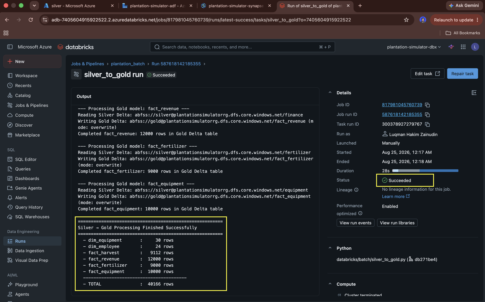

**Figure 11 — Silver → Gold task.**

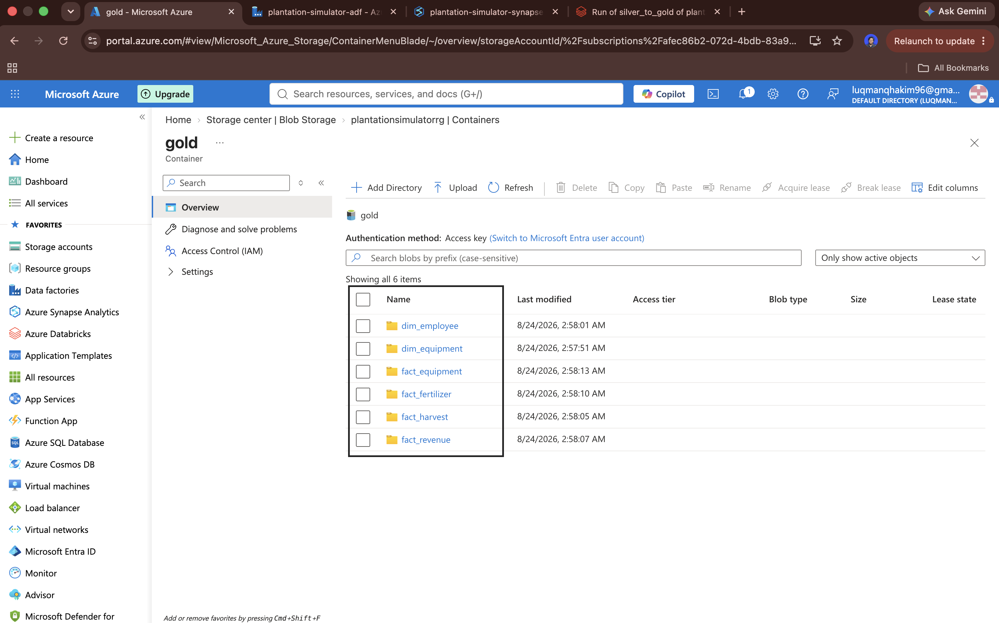

**Figure 12 — ADLS Gold.** The `gold` container holds the six Delta model folders.

---

## 15. Azure Synapse Serverless SQL (Historical Serving)

**Flow:** `ADLS Gold (Delta) → Synapse Serverless SQL → Streamlit`.

Synapse Serverless SQL provides the **historical analytical serving layer**
over Gold — with **no dedicated SQL pool** (pay-per-query, serverless only).

- **Endpoint:** built-in serverless SQL endpoint
  (`plantation-simulator-synapse-ondemand.sql.azuresynapse.net`).
- **Database:** `plantation_gold`, created with a **UTF-8 collation**
  (`Latin1_General_100_BIN2_UTF8`) — required because Delta strings are UTF-8
  (otherwise string reads fail with conversion errors).
- **Authentication:** database-scoped credential `SynapseIdentity` using the
  **workspace system-assigned managed identity** (`IDENTITY = 'Managed
  Identity'`) — no keys, SAS, or secrets.
- **External data source:** `GoldAdls` →
  `https://plantationsimulatorrg.dfs.core.windows.net/gold`.
- **Objects (two layers, schema `gold`):**
  1. **Base external views `gold.ext_*`** (6) — each uses
     `OPENROWSET(BULK '<model>/', DATA_SOURCE='GoldAdls', FORMAT='DELTA')` with
     an explicit typed column list to read a Gold Delta folder directly.
  2. **Serving views `gold.vw_*`** (6) — `vw_dim_equipment`, `vw_dim_employee`,
     `vw_fact_harvest`, `vw_fact_revenue`, `vw_fact_fertilizer`,
     `vw_fact_equipment` — stable, presentation-friendly projections over the
     `ext_*` views.

**Why Synapse Serverless?** It queries Delta on ADLS directly (no data
movement, no provisioned warehouse to pay for or manage), which is ideal for a
cost-sensitive portfolio and demonstrates a modern lakehouse serving pattern.

**Verified:** all 6 serving views return correct counts — **40,166 rows**
total, matching Gold exactly.

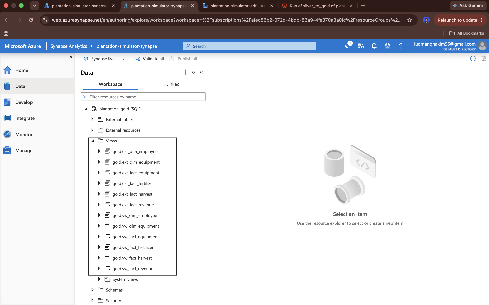

**Figure 13 — Synapse serving objects and views.**

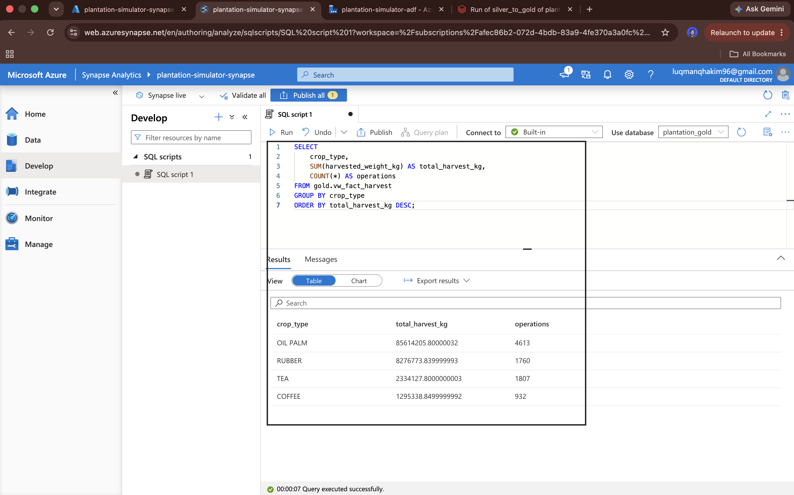

**Figure 14 — Synapse Serverless query result.**

---

## 16. Streaming / Live Sensor Pipeline

The live path is **fully independent of the batch pipeline** — it does not use
ADF, the DQ gate, Gold, or Synapse.

```
sensor_stream_to_adls.py → ADLS INCOMING
  → Auto Loader → LIVE BRONZE (Delta)
  → Structured Streaming → LIVE SILVER (Delta)
  → Databricks SQL → Streamlit
```

### 16.1 Sensor simulation & Incoming

`sensor_stream_to_adls.py` simulates **24 field sensors** (`SNS-<BLOCK>-<NN>`;
two sensors each on `BLK01/BLK05/BLK06/BLK10`, one on the other blocks) emitting
telemetry on a **15-minute cadence**. Each interval produces **one CSV
micro-batch** written to `incoming/sensors/sensors_<UTCtimestamp>.csv` (one
reading per sensor per file). The default run emits 4 intervals (= 1 hour of
telemetry); the sensor fields are `timestamp, block_id, sensor_id,
soil_moisture_pct, soil_temperature_c, air_temperature_c, humidity_pct,
soil_ph, light_intensity_lux, battery_level_pct, sensor_status`, with
`sensor_status ∈ {OK, ANOMALY, FAULT}` and a ~5% anomaly / ~1% missing-data
injection rate.

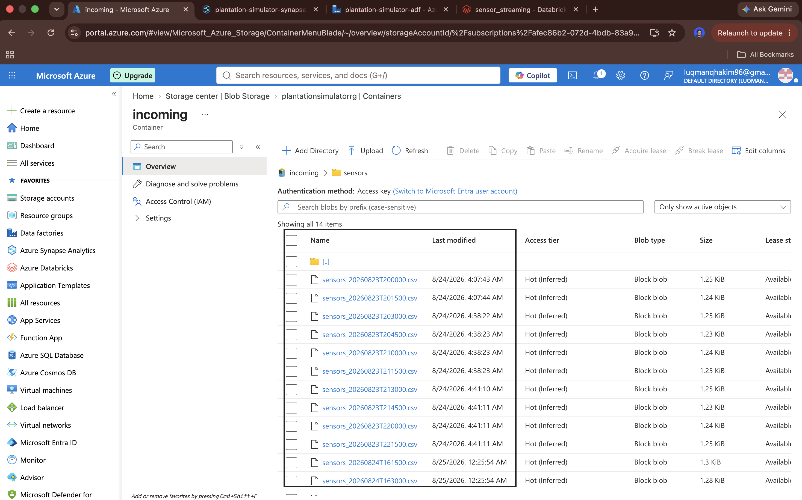

**Figure 16 — ADLS Incoming sensor micro-batches.**

### 16.2 Auto Loader → Live Bronze

`databricks/streaming/sensors_stream.py` uses **Auto Loader**
(`spark.readStream.format("cloudFiles")`) to incrementally discover new files
in `abfss://incoming@.../sensors`. It reads with an **explicit 11-column schema
— no schema inference** — and appends raw-fidelity rows to **Live Bronze Delta**
(`abfss://live-bronze@.../sensors`, `outputMode("append")`), checkpointed at
`abfss://checkpoints@.../sensors_stream/sensors_live_bronze`.

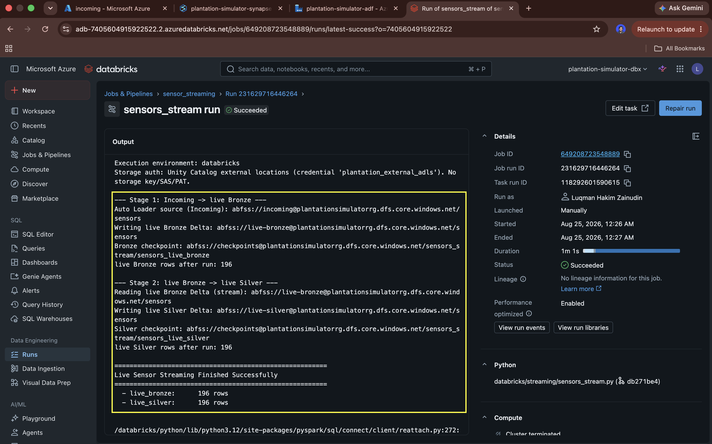

**Figure 17 — Auto Loader / streaming execution.**

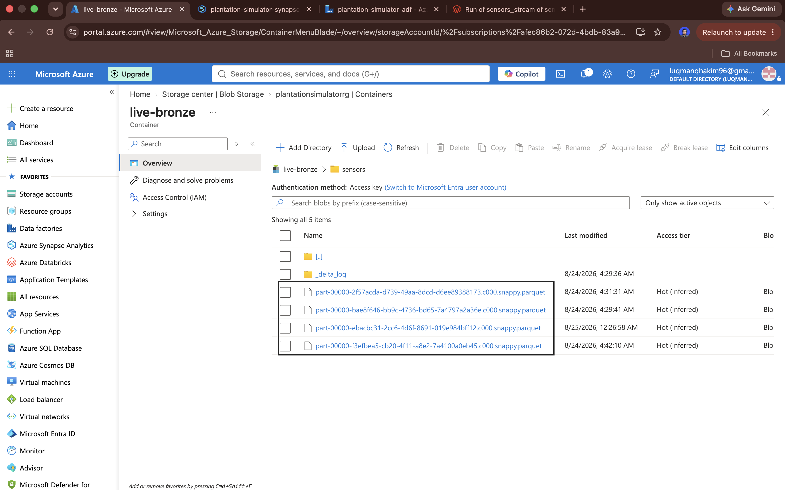

**Figure 18 — Live Bronze Delta storage.**

### 16.3 Live Bronze → Live Silver

A **second, independent stream** reads the Live Bronze Delta as a stream,
applies `transform_live_silver` (cast numerics to double treating blanks as
NULL, `to_timestamp`, upper/trim `block_id`/`sensor_id`/`sensor_status`, drop
rows missing the key, **dedup on `(sensor_id, timestamp)`**, add
`_ingested_at`), and appends to **Live Silver Delta**
(`abfss://live-silver@.../sensors`), checkpointed at
`abfss://checkpoints@.../sensors_stream/sensors_live_silver`.

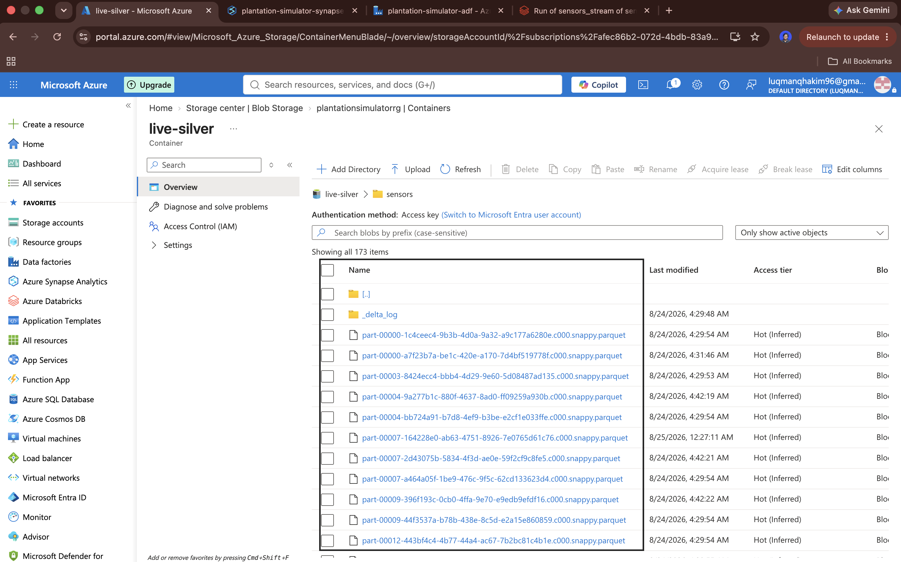

**Figure 19 — Live Silver Delta storage.**

### 16.4 Checkpoints

Each stream has its **own dedicated ADLS checkpoint** (see paths above).
Checkpoints give incremental, exactly-once-style recovery: a rerun processes
only newly arrived files, and the two stages track progress independently.
Checkpoints live on ADLS and are **never committed to Git**.

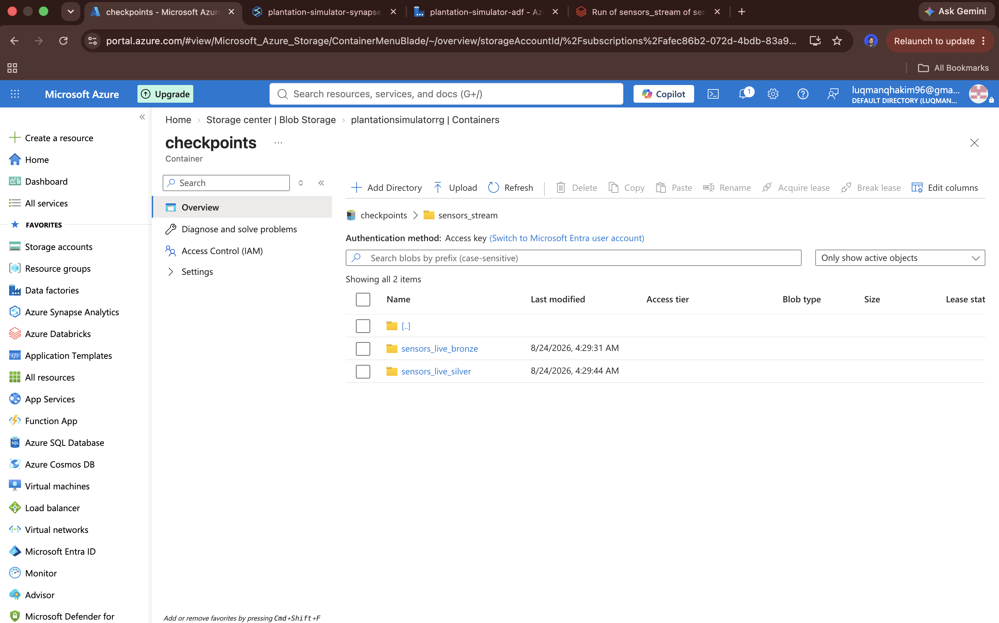

**Figure 20 — Streaming checkpoints in ADLS.**

### 16.5 `availableNow=True` — honest scoping

Both streams use **`trigger(availableNow=True)`**. This means each run **drains
all currently available micro-batches and then stops**. It is **not** an
always-on, 24/7 continuous stream.

This is a deliberate choice: drain-and-stop is appropriate for a
cost/trial-sensitive demo and for Databricks Serverless (no always-on cluster
or stream to keep warm). The Databricks `sensor_streaming` workflow carries a
schedule (`0 0/15 * * * ?` UTC) but it is **currently PAUSED** — the streaming
path is run on demand, and each run is a bounded micro-batch drain.

> **Do not** describe this path as "real-time continuous streaming." It is
> **near-real-time, incremental, drain-and-stop**.

### 16.6 Verified streaming results

The final (Phase 10) verified state: **196 readings** across Live Bronze and
Live Silver (140 from an earlier run + 56 new = 14 sensors × 4 intervals in the
final run), covering **14 active sensors**, with **190 OK / 3 ANOMALY / 3
FAULT**. Live Silver = **196 rows**.

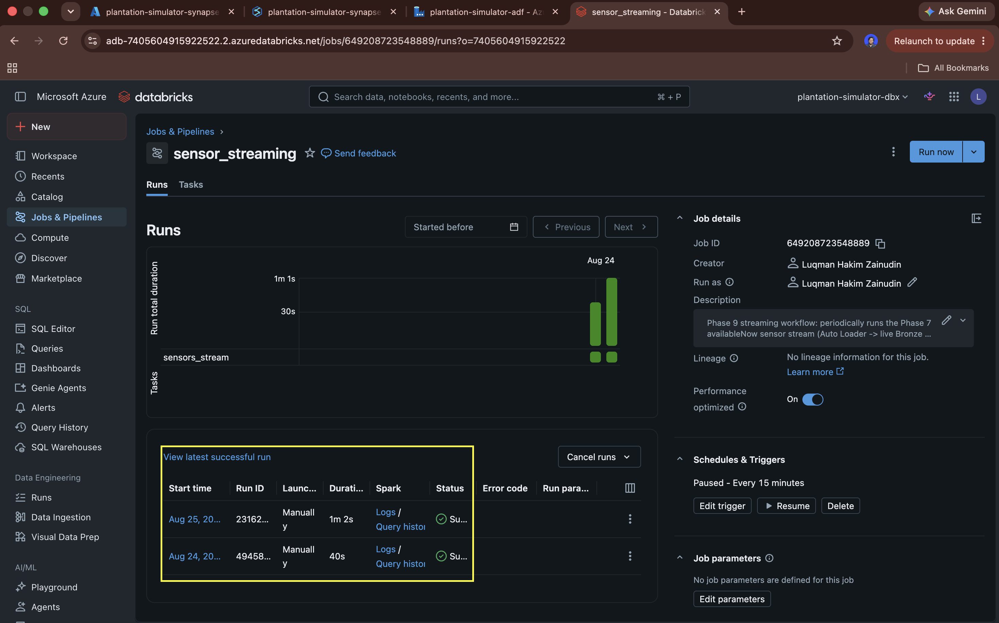

**Figure 15a — Databricks streaming workflow.**

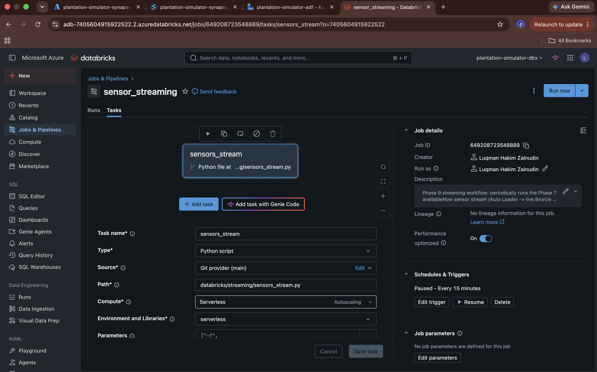

**Figure 15b — Streaming task configuration.**

---

## 17. Databricks SQL (Live Serving)

**Flow:** `Live Silver (Delta) → Databricks SQL → Streamlit live dashboard`.

- **Warehouse:** ONE shared serverless SQL Warehouse — **"Serverless Starter
  Warehouse"** (id `7d27a516598723a3`). No separate/duplicate warehouses.
- **Catalog/schema:** `plantation_simulator_dbx.live_serving`.
- **External Delta table:** `live_silver_sensors` — an **external (unmanaged)**
  Delta table registered over the Live Silver location
  (`abfss://live-silver@.../sensors`), so it reads the live data without
  copying it.
- **KPI views** (`databricks/sql/live_sensor_kpis.sql`):
  - `vw_kpi_temperature` — air & soil temperature per sensor/reading
  - `vw_kpi_humidity` — humidity per sensor/reading
  - `vw_kpi_soil_moisture` — soil moisture & pH per sensor/reading
  - `vw_kpi_sensor_status` — per-sensor rollup (last reading, reading count,
    OK/ANOMALY/FAULT counts, avg battery)

**Verified:** **196 rows**, **14 sensors**, **190 OK / 3 ANOMALY / 3 FAULT**.

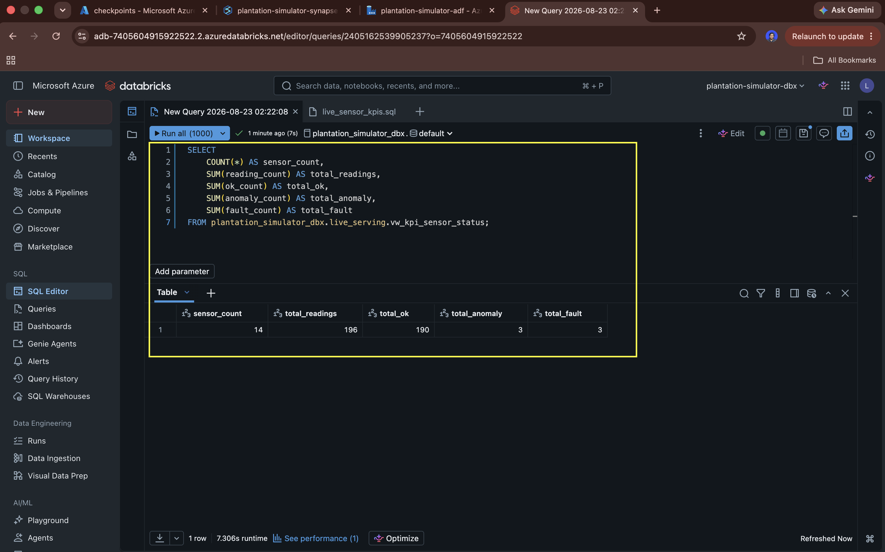

**Figure 21 — Databricks SQL live sensor serving.**

---

## 18. Streamlit Dashboard

**Run:** `streamlit run dashboard/app.py`

The dashboard (`dashboard/app.py`) is the single consumption point for **both**
paths. It renders a header banner ("Plantation Operations & Analytics"), a
sidebar ("Plantation Analytics", a **Dark Mode** toggle, and an Architecture
Context note), and **seven tabs**. The historical tabs read **Synapse Gold
serving views**; the live tab reads **Databricks SQL KPI views**. It uses
`@st.cache_data` (5-min TTL for Synapse, 1-min for live), surfaces query errors
via `st.error`, and shows a clear "not configured" warning (naming the missing
env vars) when a connection isn't set up — it **never fabricates** data.

The seven tabs (exact labels):

1. **Executive Overview** — KPI cards (Total Harvested, Harvest Operations,
   Operating Cost, Equipment Fleet, Workforce), harvest trend, harvest-by-crop,
   top blocks.
2. **Harvest** — block/crop filters; KPIs (Total Harvested, Operations,
   Completed, Completion Rate, Avg Moisture); trend, by-crop, quality-grade,
   by-block, by-destination charts.
3. **Financial / Costs** — KPIs (Total Operating Cost, Ledger Lines, Debit
   Lines, Cost Categories, Currency); cost trend, by-category, by-cost-center,
   by-fiscal-period, top GL accounts.
4. **Fertilizer** — KPIs (Total Applied, Applications, Materials Used, Blocks
   Covered, Avg/Application); trend, by-material, by-method, by-crop, top
   blocks.
5. **Equipment** — KPIs (Fleet, Operations, Equipment Used, Total Fuel,
   Maintenance Ops); fleet-by-type, operations-by-status, fuel trend,
   utilization, top-equipment charts.
6. **Workforce** — KPIs (Employees, Roles, Departments, Cost Centers);
   employees-by-role and by-department charts.
7. **Live Sensors** — KPIs (Sensors, Readings, OK, Anomaly, Fault, Avg
   Battery); sensor-health donut, per-sensor status table, and environmental
   trend charts (air/soil temperature, soil pH, soil moisture, humidity).

**Connections / auth (env vars only, no secrets in code):**

- **Historical (Synapse):** `pyodbc` + `ODBC Driver 18`. `SYNAPSE_SQL_AUTH=aad`
  (default) uses an Azure AD token from the existing local Azure CLI identity
  (`AzureCliCredential`); `=sql` uses `SYNAPSE_SQL_USERNAME/PASSWORD`. Env:
  `SYNAPSE_SQL_SERVER`, `SYNAPSE_SQL_DATABASE`, `SYNAPSE_SQL_AUTH`,
  `SYNAPSE_SQL_USERNAME`, `SYNAPSE_SQL_PASSWORD`.
- **Live (Databricks SQL):** `databricks-sql-connector` with a PAT. Env:
  `DATABRICKS_SQL_SERVER_HOSTNAME`, `DATABRICKS_SQL_HTTP_PATH`,
  `DATABRICKS_SQL_ACCESS_TOKEN`.

### Dashboard screenshot

All seven tabs are implemented and documented above. The dashboard is the
consumption layer rather than the focus of this ETL/ELT project; the captured
evidence below shows the **Live Sensors** tab rendering real sensor data served
by Databricks SQL.

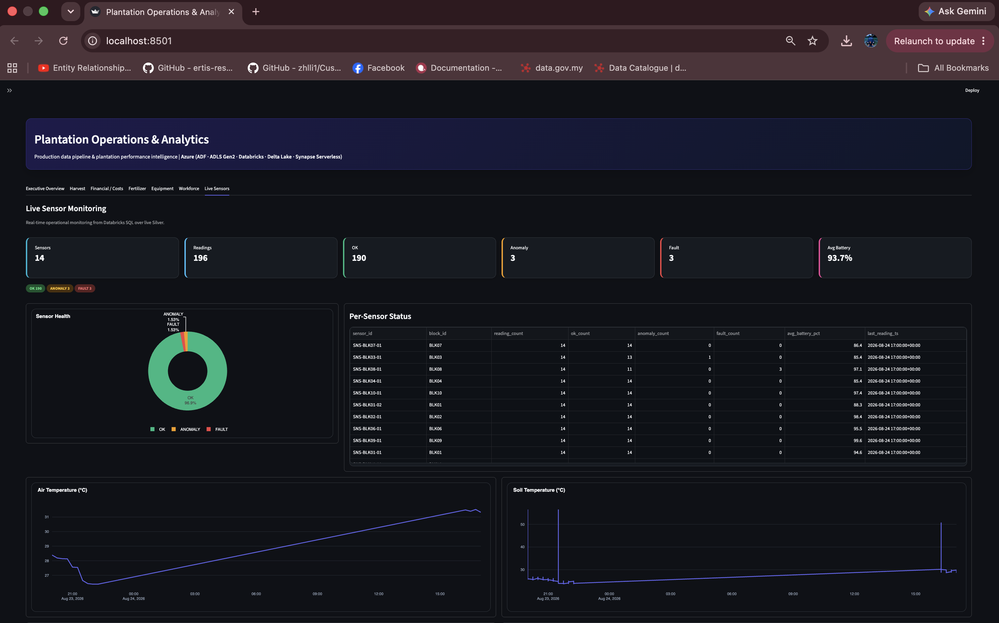

**Figure 25 — Streamlit Live Sensors.** The Live Sensors tab KPIs, per-sensor status table, and trend charts are driven by Databricks SQL — the live path renders real sensor data.

---

## 19. End-to-End Execution — What Actually Happens

This is the verified, sequential execution of the full platform. Each step
notes its trigger, executor, input → output, physical location, purpose, and
failure behaviour.

**Batch lane**

1. **Generate sources.** *Trigger:* manual
   (`python -m data_generators.run_batch_generators`). *Executor:* local Python.
   *Output:* 6 CSVs → `data/raw/<source>/`. *Why:* simulate external systems
   with reproducible ground truth. *Can fail:* missing config/master data.
2. **Deliver to Landing.** *Trigger:* manual
   (`python -m data_generators.upload_to_adls`). *Executor:* local Python → ADLS
   REST. *Output:* 6 blobs → `landing/<source>/` (48,595 rows, byte-identical).
   *Why:* external hand-off boundary. *Can fail:* missing/invalid account key,
   network. *Failure:* no Landing blobs → ADF has nothing to copy.
3. **Start batch workflow.** *Trigger:* manual/scheduled run of the Databricks
   job `plantation_batch`. *Executor:* Databricks Workflows (serverless,
   Git-source).
4. **Authenticate to Azure.** *Executor:* `trigger_adf` task (`trigger_adf.py`)
   reads the SP from secret scope `adf-sp`, acquires an ARM token. *Can fail:*
   missing/invalid secret → `AdfConfigError` → task fails → workflow stops.
5. **Trigger ADF.** `POST .../createRun` → `runId`. *Can fail:* HTTP/auth error
   → raise → workflow stops before any transform.
6. **ADF copies Landing → Bronze.** *Executor:* ADF `PL_Ingest_Landing_To_Bronze`
   (ForEach × 6 Copy, managed identity). *Output:* 6 CSVs → `bronze/<source>/`
   (overwrite/idempotent). *Can fail:* Copy error → ADF run `Failed`.
7. **Poll ADF.** `GET .../pipelineruns/{runId}` every 30s (30-min timeout).
   *Success:* `Succeeded` → proceed. *Failure:* `Failed`/`Cancelled`/timeout →
   raise → `bronze_to_silver` is skipped.
8. **Bronze → Silver.** *Trigger:* workflow after ADF success. *Executor:*
   `bronze_to_silver` (Spark). *Input:* Bronze CSV. *Output:* Silver Delta
   (`silver/<source>/`, 48,595 rows). *Why:* clean/validate/dedupe/standardize.
   *Can fail:* schema/read/compute error → task fails → DQ skipped.
9. **Data Quality gate.** *Executor:* `dq_checks` (Spark). *Input:* Silver (+
   Bronze reconciliation). *Process:* 42 checks. *Success:* all CRITICAL pass →
   proceed. *Failure:* any CRITICAL fails → raise → **Gold blocked**.
10. **Silver → Gold.** *Trigger:* workflow after DQ success. *Executor:*
    `silver_to_gold` (Spark). *Output:* Gold Delta (`gold/<model>/`, 40,166
    rows, overwrite/idempotent). *Why:* business-ready dims + facts. *Can fail:*
    transform/compute error → task fails.
11. **Serve Gold via Synapse.** *Executor:* Synapse Serverless SQL. *Input:*
    Gold Delta via `gold.ext_*` (OPENROWSET FORMAT='DELTA'). *Output:* `gold.vw_*`
    serving views (40,166 rows). *Why:* serverless historical serving.
12. **Consume analytics.** *Executor:* Streamlit. *Input:* Synapse `vw_*` views.
    *Output:* the six historical dashboard tabs.

**Streaming lane (independent)**

13. **Generate sensor files.** *Trigger:* manual
    (`sensor_stream_to_adls.py`). *Output:* per-interval CSVs →
    `incoming/sensors/`. *Can fail:* missing key (runs DRY-RUN) / network.
14. **Auto Loader ingests to Live Bronze.** *Trigger:* run of the
    `sensor_streaming` job (schedule PAUSED). *Executor:* `sensors_stream`
    (Auto Loader). *Input:* Incoming CSVs. *Output:* Live Bronze Delta
    (append), checkpointed. *Why:* incremental, schema-exact raw ingest.
15. **Live Bronze → Live Silver.** *Executor:* second stream in
    `sensors_stream`. *Output:* Live Silver Delta (196 rows), checkpointed.
    *Why:* typed, deduped, analytics-ready live state.
16. **Serve live via Databricks SQL.** *Executor:* Databricks SQL warehouse.
    *Input:* Live Silver via external table `live_silver_sensors`. *Output:*
    `live_serving.vw_kpi_*` (196 rows, 14 sensors, 190/3/3).
17. **Consume live.** *Executor:* Streamlit *Live Sensors* tab. *Input:*
    Databricks SQL KPI views. *Output:* live sensor monitoring.

Each major stage above is supported by the numbered evidence screenshots
embedded in the relevant sections of this README.

---

## 21. Verified Evidence (Run IDs)

All IDs below were observed in the real environment during the Phase 10
end-to-end verification (2026-08-24) and are indexed in
[`docs/evidence/phase-10/EVIDENCE_INDEX.md`](docs/evidence/phase-10/EVIDENCE_INDEX.md).

| Component | ID | Status |
|---|---|---|
| Databricks batch job | `817981045760739` | — |
| Databricks batch run | `587618142185355` | TERMINATED / SUCCESS |
| — `trigger_adf` task | `1109103384169245` | TERMINATED / SUCCESS |
| — `bronze_to_silver` task | `634953965469814` | TERMINATED / SUCCESS |
| — `dq_checks` task | `721436103247199` | TERMINATED / SUCCESS |
| — `silver_to_gold` task | `300378927279767` | TERMINATED / SUCCESS |
| ADF pipeline run (workflow-triggered) | `21ae0695-8c8e-455e-9029-996aec96c3ea` | Succeeded |
| ADF pipeline run (manual, pre-verification) | `016dd1f3-c557-473e-a698-0ebdc7f862b5` | Succeeded |
| Databricks streaming job | `649208723548889` | — |
| Databricks streaming run | `231629716446264` | TERMINATED / SUCCESS |
| — `sensors_stream` task | `118292601590615` | TERMINATED / SUCCESS |
| Git commit used | `db271be49de44887e8b9006b55ace3772d086f80` | — |

> Note: an earlier Phase 9 verification produced a different set of run IDs.
> The IDs above are the **final Phase 10** verified set. The manual ADF run
> `016dd1f3-…` is recorded in the evidence index as a pre-verification sanity
> run; the workflow-triggered run `21ae0695-…` is the authoritative E2E
> ingestion run.

---

## 22. Verified Data Results (E2E Reconciliation)

**Batch** — every layer reconciles exactly:

| Source | Landing | Bronze | Silver | DQ | Gold | Synapse |
|---|---|---|---|---|---|---|
| Weather | 6,483 | 6,483 | 6,483 | 7/7 | — (no model) | — |
| Harvest | 9,112 | 9,112 | 9,112 | 7/7 | `fact_harvest` 9,112 | 9,112 |
| Fertilizer | 9,000 | 9,000 | 9,000 | 7/7 | `fact_fertilizer` 9,000 | 9,000 |
| Equipment | 10,000 | 10,000 | 10,000 | 7/7 | `fact_equipment` 10,000 + `dim_equipment` 30 | 10,030 |
| HR | 2,000 | 2,000 | 2,000 | 7/7 | `dim_employee` 24 | 24 |
| Finance | 12,000 | 12,000 | 12,000 | 7/7 | `fact_revenue` 12,000 | 12,000 |
| **Total** | **48,595** | **48,595** | **48,595** | **42/42** | **40,166** | **40,166** |

> The Gold total (40,166) is intentionally **lower** than Silver (48,595):
> dimensions collapse to distinct entities (`dim_equipment` 30, `dim_employee`
> 24), weather is reference data not modelled into Gold, and the four facts
> carry their Silver grain forward.

**Streaming:**

| Incoming | Live Bronze | Live Silver | Databricks SQL |
|---|---|---|---|
| 196 readings (14 files) | 196 | 196 | 196 — 14 sensors, 190 OK / 3 ANOMALY / 3 FAULT |

---

## 23. Why Each Technology (Decisions Grounded in This Project)

- **ADLS Gen2** — the single physical data lake for every layer (Landing,
  Incoming, Bronze, Silver, Gold, Live Bronze/Silver, checkpoints). Hierarchical
  namespace gives directory semantics and atomic renames that Delta and Auto
  Loader rely on.
- **Azure Data Factory** — owns **ingestion only** (Landing → Bronze). Managed,
  serverless copy with managed-identity auth and idempotent overwrite, cleanly
  separating "move bytes" from "shape data".
- **Azure Databricks + Spark** — owns **all transformation** (Bronze→Silver,
  Silver→Gold, Live Bronze→Live Silver). A DataFrame engine is the right tool
  for schema enforcement, dedup, and business modelling.
- **Delta Lake** — the table format for Silver, Gold, and Live layers: ACID
  writes, schema enforcement, time travel, and `OPENROWSET FORMAT='DELTA'`
  readability from Synapse. (Bronze is CSV — see §11 / §25.)
- **Data Quality gate** — a hard guarantee that only validated data reaches
  Gold and the dashboard; the difference between a pipeline and a *trusted*
  pipeline.
- **Synapse Serverless SQL** — historical serving over Gold with **no
  provisioned warehouse** (pay-per-query), reading Delta directly.
- **Databricks SQL** — low-latency **live** serving over Live Silver via one
  shared serverless warehouse, keeping the live path off Synapse.
- **Auto Loader (`cloudFiles`)** — incremental, exactly-once-style file
  discovery for the streaming path, with an explicit schema (no inference
  surprises) and checkpointed recovery.
- **`availableNow=True`** — drains available micro-batches and stops: cheap,
  serverless-friendly, and honest about not being a 24/7 stream.
- **Streamlit** — a fast, Python-native way to present both Synapse
  (historical) and Databricks SQL (live) in one dashboard.

---

## 24. Failures Encountered & Lessons (Documented)

Only issues actually documented in the repo are listed.

- **Databricks Serverless `SystemExit` behaviour.** A `sys.exit(main())` /
  `SystemExit(0)` entrypoint surfaced **any** `SystemExit` (even code 0) as a
  task failure (`RUN_EXECUTION_ERROR`), and a returned int was ignored. **Fix:**
  all four task scripts call `main()` directly; success = normal return,
  failure = raised non-`SystemExit` exception. *Lesson:* on Serverless, signal
  by exception, never by exit code.
- **Git-source `__file__` undefined.** On the Git-backed Databricks workspace,
  `__file__` is undefined, breaking `__file__`-relative imports (e.g., the
  streaming job importing `bronze_to_silver` helpers). **Fix:** made module
  loading `__file__`-independent (repo-root/cwd probing with a local-only
  `__file__` fallback). *Lesson:* never depend on `__file__` in Git-source
  Databricks runs.
- **ADF Delta connector could not provision compute.** The original Bronze =
  Delta-via-Databricks-connector design was abandoned because the workspace
  couldn't provision the required capacity. **Fix (approved deviation):** ADF
  writes Bronze as **CSV**; Delta begins at Silver via Spark. *Lesson:* record
  approved deviations; keep service responsibilities unchanged.
- **ADF Copy `quoteAllText` rejection.** A `DelimitedTextInvalidSettings` error
  cancelled the first ADF run. **Fix:** removed the unsupported setting.
- **Shared Key REST signing 403 (Phase 1 uploader).** Incorrect signature
  construction caused HTTP 403. **Fix:** corrected the signature (query params
  on separate lines, sorted, path handling).
- **Spark Connect session closed.** `INVALID_HANDLE.SESSION_CLOSED` (dead
  serverless session) mid-run. **Fix:** reconnect/re-establish the session.
- **Serverless rejects `cache()`/`unpersist()`.** Removed from the DQ gate.

> **Not documented (and therefore not claimed):** a "CLI `run-now` waiting"
> failure and a "Synapse connection/cursor" failure do not appear anywhere in
> the repo's evidence and are intentionally **excluded** here.

---

## 25. Testing

Latest verified local results (Phase 10):

| Check | Result |
|---|---|
| `pytest -q` | **173 passed, 21 skipped** (~3s) |
| `ruff check .` | No errors (pre-existing style suggestions only) |
| JSON validation | All project JSON valid |
| `git diff --check` | PASS |
| Secret scan | No hardcoded secrets |

The **21 skips** are the Spark-behaviour tests guarded by
`@pytest.mark.skipif(not JAVA_AVAILABLE, …)` — they run only where a local Java
runtime + Spark is available, and are exercised in Databricks instead.

Test suite (9 files):

- `tests/test_generators.py` — config, generator outputs, uploader guards,
  Shared Key signing.
- `tests/test_schemas.py` — CSV header contracts; double-entry finance.
- `tests/test_transformations.py` — Bronze→Silver transforms & env/path logic.
- `tests/test_data_quality.py` — the 42-check gate, critical/non-critical
  behaviour, blocking.
- `tests/test_gold_transformations.py` — Gold models, grains, write modes,
  `dim_plantation` exclusion.
- `tests/test_adf_artifacts.py` — ADF JSON (pipeline/datasets/linked service,
  no Delta sink, no Databricks linked service).
- `tests/test_sensor_streaming.py` — Auto Loader config, checkpoints,
  `availableNow`, schema, decoupling.
- `tests/test_orchestrator.py` — REST URLs, auth, trigger/poll, workflow DAG
  order, no-DQ-bypass, no-secrets.
- `tests/test_dashboard.py` — dashboard sections, view references, auth config,
  no-secrets, theme.

---

## 26. Repository Structure

```
plantation-simulator-etl-elt/
├── data_generators/              # Source simulators + ADLS delivery
│   ├── config.yaml               # seed, window, sizes, master data
│   ├── fetch_weather_api.py      # weather (mock API)
│   ├── generate_harvest.py       # harvest
│   ├── generate_fertilizer.py    # fertilizer
│   ├── generate_equipment.py     # equipment
│   ├── generate_hr_attendance.py # HR / attendance
│   ├── generate_sap_finance.py   # SAP double-entry finance
│   ├── generate_sensors.py       # sensor batch generator (Phase 7)
│   ├── run_batch_generators.py   # ordered batch runner
│   ├── upload_to_adls.py         # local CSVs → ADLS Landing (only)
│   └── sensor_stream_to_adls.py  # live sensor CSVs → ADLS Incoming
├── databricks/
│   ├── batch/
│   │   ├── bronze_to_silver.py   # Spark Bronze CSV → Silver Delta
│   │   ├── dq_checks.py          # 42-check DQ gate (Silver→Gold gate)
│   │   └── silver_to_gold.py     # Spark Silver → Gold Delta (dims+facts)
│   ├── orchestrator/
│   │   └── trigger_adf.py        # ADF REST trigger + poll (SP auth)
│   ├── streaming/
│   │   └── sensors_stream.py     # Auto Loader → Live Bronze → Live Silver
│   ├── sql/
│   │   └── live_sensor_kpis.sql  # Databricks SQL external table + KPI views
│   ├── workflows/
│   │   ├── plantation_batch.json # batch workflow (4-task DAG)
│   │   └── sensor_streaming.json # streaming workflow (PAUSED schedule)
│   ├── verify_gold.py            # read-only Gold verifier
│   └── verify_silver.ipynb.ipynb # Silver exploration notebook
├── adf/
│   ├── pipeline/PL_Ingest_Landing_To_Bronze.json
│   ├── dataset/DS_Landing_Source.json
│   ├── dataset/DS_Bronze_Sink.json
│   ├── linkedService/LS_Adls_PlantationSimulator.json
│   └── scripts/verify_bronze.py  # read-only Bronze/Landing verifier
├── synapse/sql/
│   ├── external_tables.sql       # plantation_gold db + gold.ext_* (DELTA)
│   └── plantation_views.sql      # gold.vw_* serving views
├── dashboard/
│   └── app.py                    # Streamlit dashboard (7 sections)
├── tests/                        # 173 tests (9 files)
├── docs/
│   ├── evidence/phase-10/        # EVIDENCE_INDEX.md + captured PNGs
│   └── *.md                      # design/deployment/troubleshooting (placeholders)
├── data/                         # local simulation scratch (git-ignored)
├── ARCHITECTURE.md               # frozen target architecture (source of truth)
├── IMPLEMENTATION_PLAN.md        # phased roadmap + per-phase evidence
├── AGENTS.md                     # operating rules / anti-hallucination
└── requirements.txt
```

> Note: `docs/troubleshooting.md`, `docs/pipeline_design.md`,
> `docs/deployment.md`, and `docs/data_dictionary.md` are present but currently
> empty placeholders; the substantive content lives in `ARCHITECTURE.md`,
> `IMPLEMENTATION_PLAN.md`, this README, and `docs/evidence/phase-10/`.

---

## 27. Design Decisions

1. **ADF handles Landing → Bronze (ingestion only).** Clean separation of
   "move bytes" from "shape data"; managed identity auth; idempotent overwrite.
2. **Databricks/Spark owns all transformation.** Bronze→Silver and Silver→Gold
   (and Live Bronze→Live Silver) are Spark DataFrame jobs — the right tool for
   schema enforcement, dedup, and modelling.
3. **Delta for Silver/Gold/Live.** ACID, schema enforcement, and direct
   readability from Synapse (`FORMAT='DELTA'`).
4. **Bronze is CSV (approved deviation).** The ADF Delta connector couldn't
   provision compute, so Bronze is file-based CSV; Delta starts at Silver.
5. **DQ is a hard gate.** `silver_to_gold` depends on `dq_checks`; any CRITICAL
   failure blocks Gold. Bad data never reaches analytics.
6. **Synapse Serverless for historical serving.** No dedicated pool; queries
   Gold Delta directly; pay-per-query.
7. **Streaming is independent of batch.** It bypasses ADF, DQ, Gold, and
   Synapse — different lifecycle and purpose.
8. **Auto Loader for streaming ingest.** Incremental, checkpointed, explicit
   schema (no inference).
9. **`availableNow=True`.** Drain-and-stop micro-batches — cost/serverless
   friendly; not a 24/7 stream.
10. **Streamlit for consumption.** One dashboard over both Synapse (historical)
    and Databricks SQL (live).
11. **Authentication without secrets.** Unity Catalog external locations
    (storage credential `plantation_external_adls`) for Databricks storage
    access; ADF + Synapse use managed identities; dashboard uses env vars; the
    ADF trigger reads an SP from a Databricks secret scope. **No storage keys,
    SAS tokens, PATs, or secrets are committed anywhere.**
12. **Serverless Git-source Databricks jobs.** `spark_python_task` with
    `source: GIT` (repo `main`), serverless environment — no cluster to manage;
    idempotent, reproducible.
13. **Idempotent writes.** Silver/Gold use `overwrite` + `overwriteSchema`;
    ADF sink uses `Overwrite` — safe reruns with no duplicate growth.
14. **No `dim_plantation`.** No block master exists in Silver; creating one
    would fabricate data.

---

## 28. Limitations (Honest)

- **Streaming is drain-and-stop, not continuous.** Both streams use
  `trigger(availableNow=True)` — each run drains available micro-batches and
  terminates. This is **not** an always-on 24/7 stream.
- **Streaming schedule is PAUSED.** The `sensor_streaming` workflow's cron
  schedule (`0 0/15 * * * ?` UTC) exists but is currently **PAUSED**; the
  streaming path is run on demand.
- **All data is simulated.** No real plantation operational data; the value is
  in the verified platform, not the realism of the numbers.
- **Bronze is CSV, not Delta** (approved deviation; see §11).
- **No CI/CD, IaC, or alerting.** Resources were provisioned/verified directly;
  there is no Terraform/Bicep, GitHub Actions deployment, or monitoring/alerting
  layer (out of scope for a one-day portfolio build).
- **Single environment.** One dev/trial subscription; no multi-environment
  promotion.
- **Cost-constrained scale.** Data volumes are intentionally small
  (simulated); the platform is not tuned for large-scale production loads.
- **Databricks SQL live path uses a PAT** from the dashboard side (env var);
  a production setup would use OAuth/service-principal auth.

---

## 29. Reproducibility / How to Run

> Never commit secrets. `.env.example` documents variable **names only**; copy
> it to a git-ignored `.env` and fill in real values locally.

### 29.1 Local development

```bash
python -m venv .venv && source .venv/bin/activate
pip install -r requirements.txt
cp .env.example .env        # fill in values locally
pytest -q                   # 173 passed, 21 skipped
ruff check .
```

### 29.2 Source simulation + Landing delivery

```bash
# Generate the six batch CSVs into data/raw/
python -m data_generators.run_batch_generators

# Upload to ADLS Landing (requires AZURE_STORAGE_ACCOUNT + AZURE_STORAGE_ACCOUNT_KEY;
# runs in DRY-RUN mode with no key set)
python -m data_generators.upload_to_adls
```

### 29.3 Azure / Databricks deployment (summary)

Provisioned per `ARCHITECTURE.md` / `IMPLEMENTATION_PLAN.md`: ADLS Gen2 account
with the 8 containers; ADF with `LS_Adls_PlantationSimulator` (managed identity
+ Storage Blob Data Contributor) and `PL_Ingest_Landing_To_Bronze`; Databricks
workspace with Unity Catalog external locations (storage credential
`plantation_external_adls`), one serverless SQL Warehouse, and the two
Git-source workflows (`databricks/workflows/*.json`); Synapse serverless
database `plantation_gold` (`synapse/sql/*.sql`); Databricks SQL live objects
(`databricks/sql/live_sensor_kpis.sql`).

### 29.4 Run the batch pipeline

Run the Databricks job **`plantation_batch`** (Job ID `817981045760739`). It
executes `trigger_adf → bronze_to_silver → dq_checks → silver_to_gold` — i.e.,
it triggers ADF via REST, polls to Succeeded, then transforms, quality-gates,
and models to Gold.

### 29.5 Run the streaming pipeline

```bash
# Emit sensor micro-batches to ADLS Incoming
python -m data_generators.sensor_stream_to_adls
```

Then run the Databricks job **`sensor_streaming`** (Job ID `649208723548889`).
It runs `sensors_stream` (Auto Loader → Live Bronze → Live Silver) with
`availableNow=True`, draining available files and stopping.

### 29.6 Run the dashboard

```bash
# Configure Synapse (historical) and Databricks SQL (live) env vars in .env
streamlit run dashboard/app.py
```

### 29.7 Required environment variables (names only)

- **Storage (upload/verify):** `AZURE_STORAGE_ACCOUNT`,
  `AZURE_STORAGE_ACCOUNT_KEY` (optional → DRY-RUN), `ADLS_LANDING_CONTAINER`.
- **Synapse (historical):** `SYNAPSE_SQL_SERVER`, `SYNAPSE_SQL_DATABASE`,
  `SYNAPSE_SQL_AUTH` (`aad`|`sql`), `SYNAPSE_SQL_USERNAME`,
  `SYNAPSE_SQL_PASSWORD`.
- **Databricks SQL (live):** `DATABRICKS_SQL_SERVER_HOSTNAME`,
  `DATABRICKS_SQL_HTTP_PATH`, `DATABRICKS_SQL_ACCESS_TOKEN`.
- **ADF SP (Phase 9 trigger, local fallback):** `AZURE_CLIENT_ID`,
  `AZURE_CLIENT_SECRET` (on Databricks these come from secret scope `adf-sp`).
- **Optional (live weather, disabled):** `OPENWEATHER_API_KEY`.

---

## Control Documents

- [`ARCHITECTURE.md`](ARCHITECTURE.md) — the frozen target architecture
  (single source of truth for design).
- [`IMPLEMENTATION_PLAN.md`](IMPLEMENTATION_PLAN.md) — the phased roadmap with
  per-phase verified evidence.
- [`AGENTS.md`](AGENTS.md) — operating rules, including the anti-hallucination
  discipline this project follows.
- [`docs/evidence/phase-10/EVIDENCE_INDEX.md`](docs/evidence/phase-10/EVIDENCE_INDEX.md)
  — the index of every verified run ID, row count, and screenshot.
